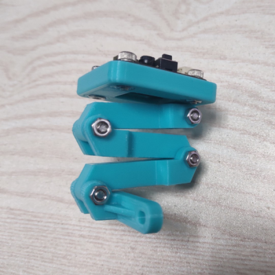

# 3D打印支架

对于购买MU裸板的用户，我们提供了3D打印的外壳和折叠支架文件，可以在小车等使用场景下固定和调节传感器的角度，有3D打印机的创客可自行打印。

[MU3 3D打印支架](https://github.com/mu-opensource/Morpx-docs/raw/master/MUVS3/MUVS3_Resource/sources/MU_foldable_bracket.zip)

# 自动炮台