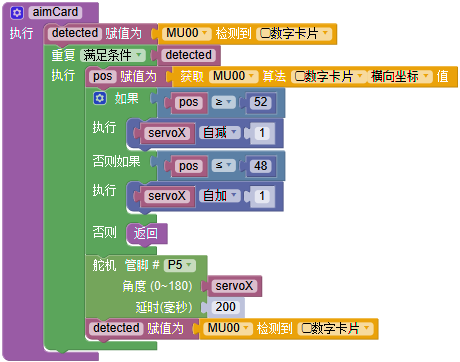
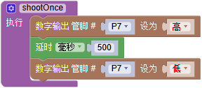

# 自动炮台

## 简介

本项目是改装狄仁杰小车平台制作的自动寻找并射击靶子的炮台。通过安装在炮台前端的MU识别靶子，精确定位其坐标，反馈控制水弹枪射击。

## 自动炮台组成

- 水弹发射器

- 舵机云台

- MU3视觉传感器

- 掌控板+盘古斧

- 聚合物锂电池 + 18650动力锂电池供电

- 改装可被识别的靶子

这个就是我的自动炮台，采用MoonBot的金属钣金制作舵机云台，实现双舵机控制炮台两个自由度的运动。
额外加了一个固定水弹枪体的3D打印支架和固定用的钣金底座。将MU可识别的数字卡片贴在原本的电动靶上，同时还增大了目标更容易射中 囧。。。

## 程序解析

- 初始设置程序

初始化中对将要用到的外设进行设置，包括舵机和MU。

- 寻找卡片函数

寻找卡片采用舵机左右移动的方式，配合上下微调，找寻180度视角范围内的卡片。

- 对准卡片函数

当寻找到卡片时，进入对准卡片的程序。通过舵机移动修正炮和卡片之间的距离。

- 发射函数

比较简单，通过控制P脚直接输出高电平发射，约0.5秒时间，可以打出约3发水弹，如果击倒比较容易则可以时间更短些。

- 循环程序

将以上函数组合后就是循环程序的内容。

- 远程控制程序

另外可以加入Blynk远程开启炮台的程序，将循环程序作为子程序整体放入Blynk中。按键按下则触发循环程序执行自动发射。

# 网帖汇总

[掌控慧眼小MU系列教程](https://makelog.dfrobot.com.cn/article-1746.html)

[小MU|小狗狗，认数字](http://mc.dfrobot.com.cn/thread-296734-1-1.html)

[人工智能（障）——麦昆人体识别与追踪](http://mc.dfrobot.com.cn/thread-296584-1-1.html)

[自动跟随的麦克纳姆轮小车](http://mc.dfrobot.com.cn/thread-296803-1-1.html)

[小MU掌控板之乘法连连看](http://mc.dfrobot.com.cn/thread-296782-1-1.html)
