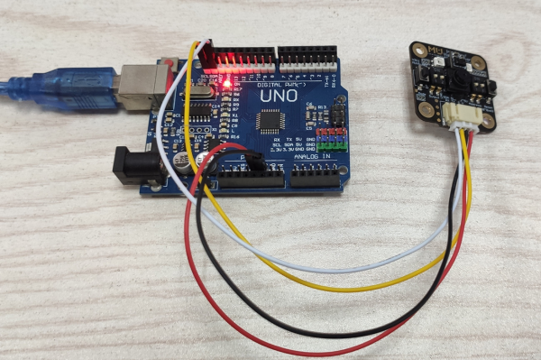

# Arduino库导入

1.在Arduino官网下载安装最新的 Arduino IDE：
<https://www.arduino.cc/en/Main/Software>

2.在github下载最新的MUVisionSensor3的Arduino库（Source code(zip)文件）：
<https://github.com/mu-opensource/MuVisionSensor3/releases/latest>

3.打开 Arduino IDE ，点击`项目->加载库->添加.ZIP库`，选择步骤2中下载ZIP文件，点击`确定`按钮完成库的添加

# Arduino硬件连接

MU Vision Sensor 3的外设和接口如图所示：

## I2C模式

1. 将模块左侧输出模式拨码开关1拨至下方，2拨至上方，切换至I2C模式；
2. （不推荐修改此设置）将模块右侧的地址选择拨码开关拨至对应位（默认地址0x60，1、2都在下方）；
3. 将MU输出接口`SDA`口接至 Arduino 对应的`SDA`口，`SCL`口接至 Arduino 对应的`SCL`口。

## 串口模式

1. 将模块左侧输出模式拨码开关1、2都拨至下方，切换至串口模式；
2. （不推荐修改此设置）将模块右侧的地址选择拨码开关拨至对应位（默认地址0x60，1、2都在下方）；
3. 将MU输出接口`RX`口接至 Arduino 对应的`TX`口，`TX`口接至 Arduino 对应的`RX`口。

## AT指令模式（适用于V1.1.5及以上版本的固件）

1. 将模块左侧输出模式拨码开关1拨至上方，2拨至下方，切换至AT指令模式；
2. 将MU输出接口`RX`口接至 Arduino 对应的`TX`口，`TX`口接至 Arduino 对应的`RX`口。

## 图传模式（适用于V1.1.5及以上版本的固件）

1. 将模块左侧输出模式拨码开关1、2都拨至上方，切换至图传模式；
2. 将MU输出接口`RX`口接至 Arduino 对应的`TX`口，`TX`口接至 Arduino 对应的`RX`口。

# 示例说明

打开Arduino IDE，选择顶部的`工具->开发板`，常用开发板为Arduino Uno。

如果使用MoonBot主控，则选开发板为`Arduino Mega 2560`，并选择处理器为`ATmega 1280`。连接开发板后选择相应端口则完成Arduino开发板的连接。

如果成功导入了开发板兼容的库，选择顶部的`文件->示例->第三方库示例->MU Vision Sensor 3`即可打开官方示例程序。

`ball`：球检测示例

`body`：人体检测示例

`colorDetect`：颜色检测示例

`colorRecognition`：颜色识别示例

`gestureDetection`：手势识别示例

`getTargetPosition`：获取目标位置示例

`getTargetPositionAT`：使用AT指令获取目标位置示例

`lightSensorDetect`：光线传感器通用功能示例（接近检测，颜色检测，光线检测）

`numberCard`：数字卡片示例

`shapeCard`：形状卡片示例

`trafficCard`：交通卡片示例

`arduino_base_interface`：串口直接发送字符示例
