# 传感器扩展库导入

打开MakeCode并新建一个项目，在模块工具箱中点击`高级`->`扩展`；

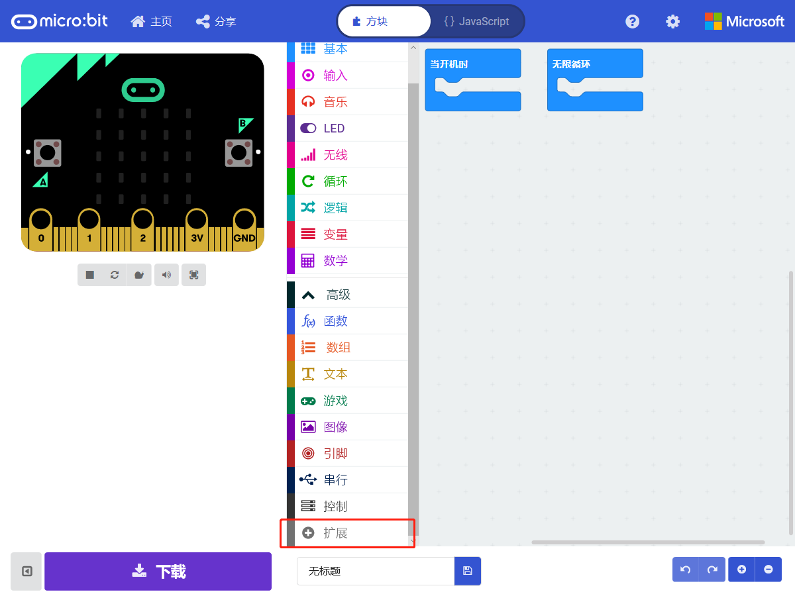

搜索 `muvision` 或 `mu` (旧版链接 `mu-opensource/pxt-MuVisionSensor3` 已弃用，请尽快转至新版库)，点击卡片完成添加。

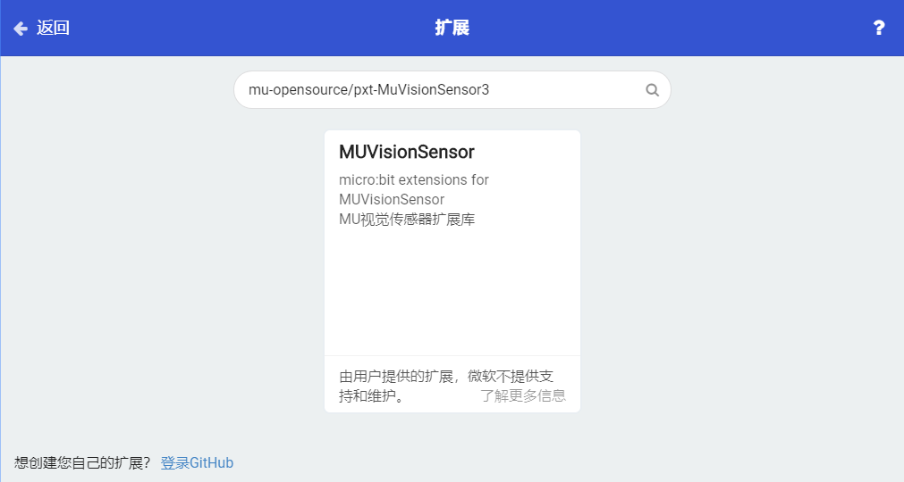

# Micro:bit硬件连接

MU Vision Sensor 3 的外设和接口如图所示：

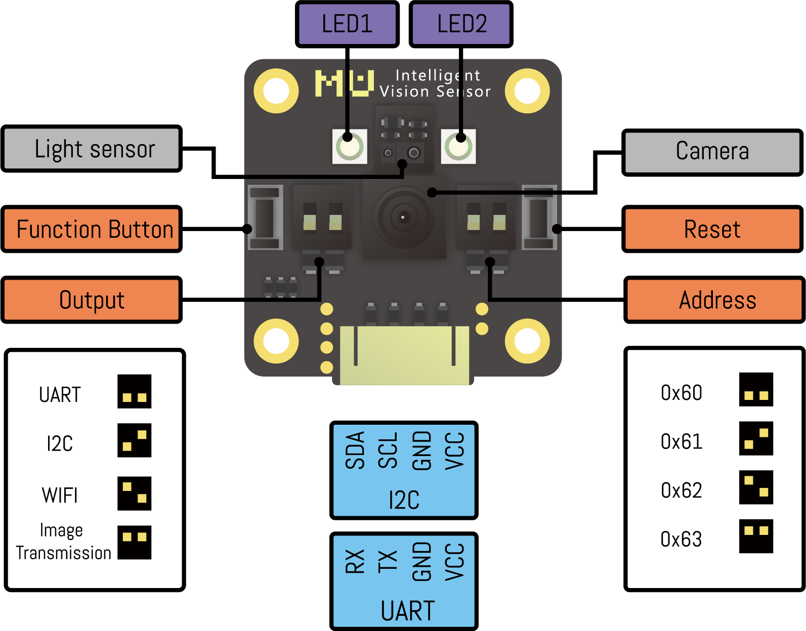

## I2C模式

1. 将传感器左侧输出模式拨码开关1拨至下方，2拨至上方；

2. 将传感器输出接口SDA引脚（P1）和SCL引脚（P2）接至 Micro:bit 对应的 SDA 引脚（P20）与 SCL 引脚（P19），同时将 P3 接地， P4 接电源（3.3-5V）；

3. 将传感器的地址选择拨码开关拨至对应位（默认地址`0x60`则 1、2都在下方，不推荐修改此设置）。

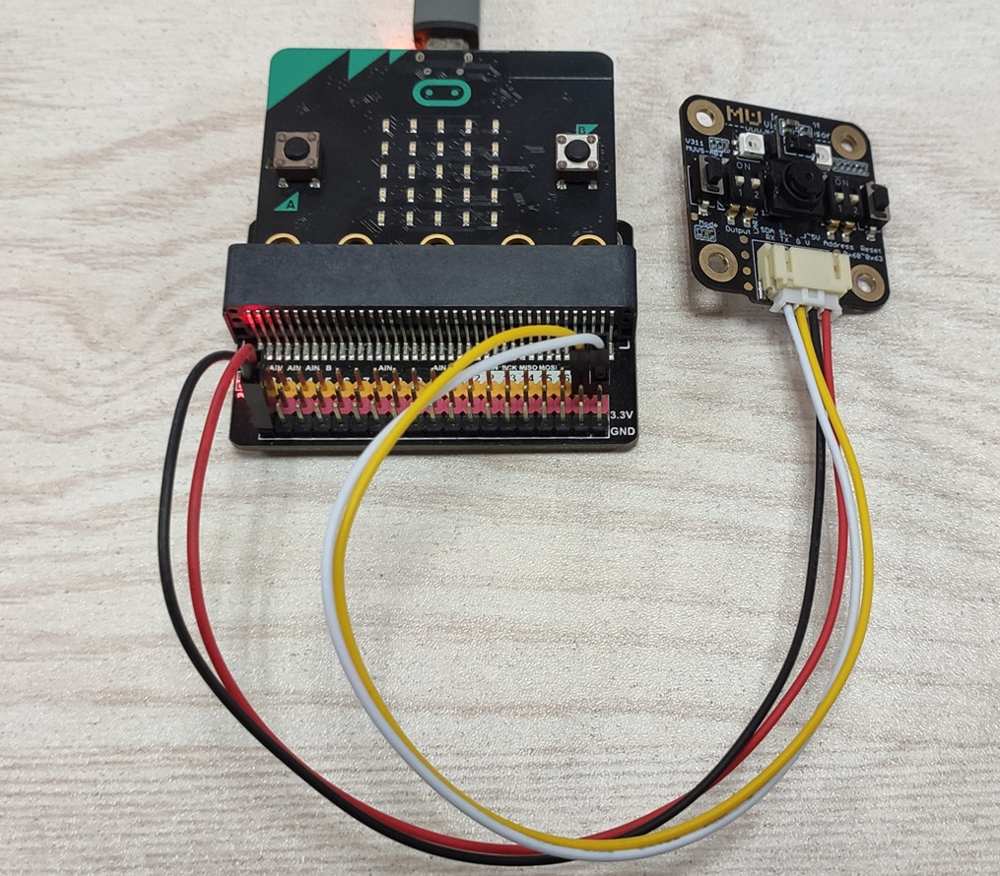

## 串口模式

1. 将传感器左侧输出模式拨码开关1、2均拨至下方；

2. 将传感器输出接口RX引脚（P1）接至Micro:bit 对应的TX 引脚， TX引脚（P2）口接至Micro:bit 对应的RX 引脚，同时将P3接地，P4接电源（3.3-5V）；

3. 将传感器的地址选择拨码开关拨至对应位（默认地址0x60则 1、2都在下方，不推荐修改此设置）。

*当前版本中串口模式下Micro:bit将无法通过USB串口打印调试信息，串口波特率固定为9600。*

## AT指令模式（适用于V1.1.5及以上版本的固件）

1. 将模块左侧输出模式拨码开关1拨至上方，2拨至下方，切换至AT指令模式；

2. 将MU输出接口`RX`口接至Micro:bit对应的`TX`口，`TX`口接至Micro:bit对应的`RX`口。

## 图传模式（适用于V1.1.5及以上版本的固件）

1. 将模块左侧输出模式拨码开关1、2都拨至上方，切换至图传模式；

2. 将MU输出接口`RX`口接至Micro:bit对应的`TX`口，`TX`口接至Micro:bit对应的`RX`口。

# 模块使用介绍

## MU视觉传感器

### 初始化模块

1. Serial模式：根据Micro:bit与小MU视觉传感器的硬件连接自定义串口重定向模块中的TX、RX引脚号，示例中采用了Micro:bit的P12与P13。

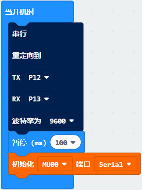

2. I2C模式：Micro:bit与小MU视觉传感器的连接初始化为I2C模式。

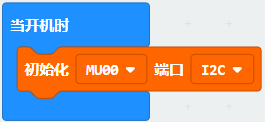

### 开启算法

当前版本共有如下7种算法，每种算法的具体分类和返回结果详见小MU视觉传感器技术规格书文档。

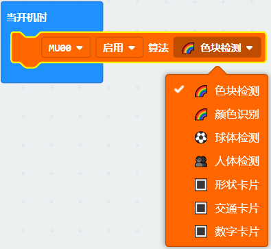

### 设置算法性能

不同算法性能下识别的速度与准确率会有所差异，可根据实际的应用需要选择合适的性能参数。

速度优先：简单环境下使用，识别速度快，误报率稍高；

性能均衡：默认模式；

准确率优先：复杂场景情况下使用，识别速度稍慢，误报率低；当多类识别算法同时开启时，譬如形状卡片与交通卡片混合摆放识别时，请采用该模式，以消除不同组卡片间的误报。

### 关闭/开启摄像头高帧率模式

默认使用高帧率模式，相对普通模式有更快的识别速度，但功耗和发热量随之增加，可用于快速检测的场景，如需要低功耗使用则可关闭。

### 设置摄像头白平衡

当摄像头视野中出现大面积有颜色的物体时，摄像头会发生白平衡失真，产生偏色现象，通过事先锁定白平衡能够防止此问题的发生。在调用此编程模块时，需要将摄像头朝向白纸距离约20厘米进行测光，数秒后摄像头的白平衡会自动被锁定。

### 设置摄像头数码变焦

数码变焦等级越大可检测的距离越远，但视野范围会变窄。

数码变焦等级1(距离近,视野广)~数码变焦等级5(距离远,视野窄)。

针对不同距离的物体通过试验测试合理设置数码变焦等级值可以取得较好的识别效果。

### 板载LED灯光设置

小MU视觉传感器正面板载的两颗LED灯每闪烁一次表示执行一帧图像识别。

可通过设置识别到目标与未识别到目标时灯光的颜色来获得反馈。

默认设置：未检测到闪红灯，检测到则闪蓝灯。当进行颜色识别时，默认LED关闭。

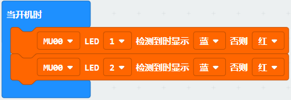

### 恢复模块默认设置

关闭所有算法，重置所有硬件设置

### 光线传感器开启功能

开启光线传感器对应功能，手势检测功能无法与其他功能共用。

### 光线传感器设置灵敏度

### 光线传感器读取接近检测数值

### 光线传感器读取环境光检测数值

### 光线传感器读取手势检测状态

### 光线传感器读取手势检测结果

## MU视觉传感器WiFi

WiFi 配置模块只能在 `WiFi` 和 `图传` 模式下使用。

### 读取本地 IP

读取 MU 的 IP。

### 读取目标 IP

读取目标 IP。

### WiFi 配置

配置 WiFi 账号密码及模式。

### WiFi 连接

尝试开启/关闭 WiFi 连接，若成功，则返回 `true`。

### WiFi 配置目标 IP

配置目标 IP，需 WiFi 连接成功后调用才生效。

### WiFi 读取透传数据

读取目标设备向 MU 发送的数据。

# 完整示例

### 球体与人体检测

初始程序：采用I2C连接，启用球体检测算法，其余设置为默认。

循环程序：如果视觉传感器检测到球，会通过I2C向Micro:bit发送检测到的数据，Micro:bit会通过串口向电脑发送检测到的信息，否则循环显示未检测到球，人体检测同理。

实验现象：未检测到球则视觉传感器闪红灯，控制台显示”ball undetected”。检测到球则视觉传感器闪蓝灯，控制台显示返回的坐标等信息。

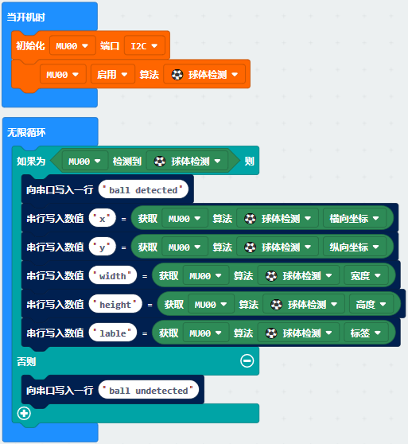

### 卡片识别

初始程序：采用I2C连接，启用交通卡片识别算法，其余设置为默认。

循环程序：如果视觉传感器检测到交通卡片，会通过I2C向Micro:bit发送检测到的数据，Micro:bit会通过串口向电脑发送识别到的位置和类型信息，否则循环显示未识别，其他类型的卡片识别同理。

实验现象：未检测到卡片则视觉传感器LED闪红灯，控制台显示”card undetected”。识别到则视觉传感器LED闪蓝灯，控制台显示返回的坐标信息和交通卡片的具体图案信息。

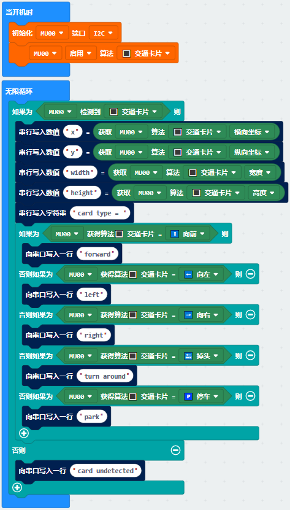

### 颜色识别

初始程序：采用I2C连接，启用颜色识别算法，锁定摄像头白平衡防止偏色，其余设置为默认。

循环程序：视觉传感器识别坐标(50,50)处的颜色，通过I2C向Micro:bit发送检测到的数据，Micro:bit会通过串口向电脑发送识别到的通道信息和颜色类别。

实验现象：视觉传感器始终不闪灯，控制台显示返回的通道值和颜色的类别。

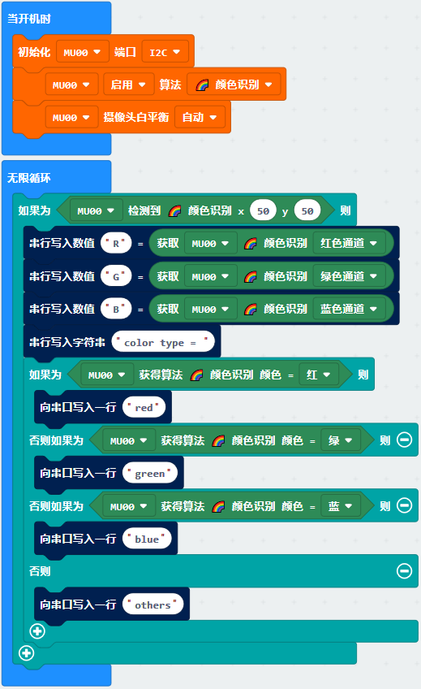

### 色块检测

初始程序：采用I2C连接，启用色块检测算法，锁定摄像头白平衡防止偏色，其余设置为默认。

循环程序：如果视觉传感器检测到红色块，会通过I2C向Micro:bit发送检测到的数据，Micro:bit会通过串口向电脑发送识别到的位置和类型信息，否则循环显示未检测到。

实验现象：未识别到时视觉传感器闪红灯，控制台显示”color block undetected”。识别到红色块则视觉传感器闪蓝灯，控制台显示获得的红色块坐标大小信息。

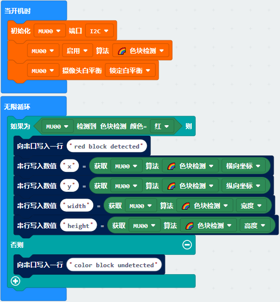

### 串口模式示例

拨动左侧输出模式拨码开关至串口模式，MU可采用串口连接Micro:bit。由于此模式下电脑无法与Micro:bit串口通讯，所以使用Micro:bit自带的点阵屏直接显示检测结果。

初始程序：重新定义串口引脚到P14和P13，采用串口连接，启用数字卡片识别算法，其余设置为默认。

循环程序：如果视觉传感器检测到数字卡片，会通过串口向Micro:bit发送数据，使用Micro:bit自带的LED显示识别到的数字，以1和2为示例，其他卡片类型同理。

实验现象：未检测到数字卡片时视觉传感器闪红灯，检测到时闪蓝灯，当识别到卡片为1时Micro:bit显示数字1，识别到卡片2时显示数字2。

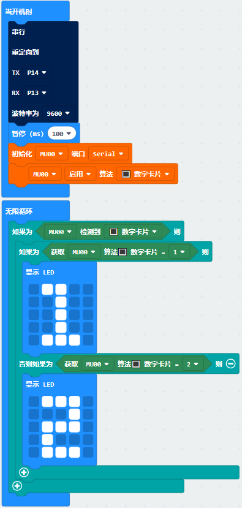

更多例程可参考：<https://makecode.microbit.org/pkg/mu-opensource/pxt-muvision>
