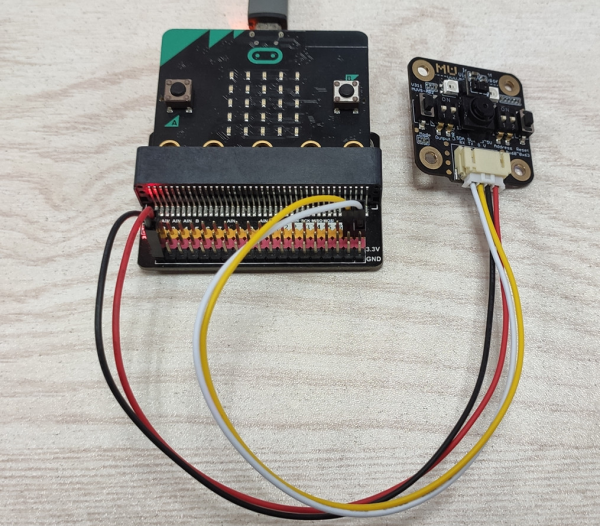

# 配置Mu Editor和Micro:bit

Mu Editor是一款具有友好GUI界面的MicroPython集成开发工具，包含了代码编辑、烧录、REPL终端、串口绘图器等功能。通过Micro:bit主板控制小MU视觉传感器，需要使用包含了MUVisionSensor传感器的MicroPython固件，请按以下步骤进行设置：

（1）下载Micro:bit固件：

GitHub：<https://github.com/mu-opensource/MuVisionSensor3-MicroPython>

morpx官网：<http://mai.morpx.com/page.php?a=sensor-support>

（2）更新Micro:bit固件：

将Micro:bit通过USB线连接电脑，出现Micro:bit的磁盘，将下载的固件microbit-micropython-MuVisionSensor-x.x.x.hex 文件拖入磁盘中，Micro:bit将自动更新固件并重启。

（3）下载并安装Mu Editor：<https://codewith.mu/>

（4）导入传感器

打开Mu Editor，在顶部选择模式为 BBC micro:bit，连接micro:bit后左下角显示`连接到新的micro:bit 设备`即可进行编程。单击顶部REPL按钮进入串口实时模式，micro:bit将返回固件版本信息。输入：

```python
>>> from MuVisionSensor import *
```

导入传感器后即可使用MuVisonSensor类中的所有公开API

****MuVisionSensor传感器中关键字的自动补全仅在REPL模式下可用***


# Micro:bit硬件连接

MU Vision Sensor 3的外设和接口如图所示：


（1）将传感器左侧输出模式拨码开关1拨至下方，2拨至上方；

（2）将传感器输出接口SDA引脚（P1）和SCL引脚（P2）接至Micro:bit 对应的 SDA引脚（P20）与SCL引脚（P19），同时将P3接地，P4接电源（3.3-5V）；

（3）将传感器的地址选择拨码开关拨至对应位（默认地址0x60则 1、2都在下方，不推荐修改此设置）。

****目前仅支持I2C模式***



# API使用说明

MuVisionSensor 库内所有的的函数及可选参数的枚举可以通过以下代码获取：

```python
import MuVisionSensor                   #导入库
help(MuVisionSensor)                    #获取可选枚举类型
help(MuVisionSensor.MuVisionSensor)     #获取所有函数
```

## 构造函数

**API:**

实例化一个对象，并指定传感器地址，指定的地址要与地址选择拨码开关的设置保持一致，默认地址为`0x60`

```python
MuVisionSensor.MuVisionSensor(address=0x60)
```

## 初始化

初始化传感器

**API:**

```python
MuVisionSensor.begin()
```

## 开启算法

**API:**

```python
MuVisionSensor.VisionBegin(vision_type)
```

目前支持的vision_type有：

`VISION_COLOR_DETECT`        颜色检测

`VISION_COLOR_RECOGNITION`   颜色识别

`VISION_BALL_DETECT`         球体检测

`VISION_BODY_DETECT`         人体检测

`VISION_SHAPE_CARD_DETECT`   形状卡片检测

`VISION_TRAFFIC_CARD_DETECT` 交通卡片检测

`VISION_NUM_CARD_DETECT`     数字卡片检测

`VISION_ALL`                开启所有算法

**示例：**

```python
from MuVisionSensor import *                #导入库
mu=MuVisionSensor(0x60)                     #实例化MU变量
mu.begin()                                  #初始化MU

mu.VisionBegin(VISION_COLOR_DETECT)         #开启颜色检测算法
mu.VisionBegin(VISION_SHAPE_CARD_DETECT | VISION_BALL_DETECT) #同时开启形状卡片检测和球体检测算法
```

## 设置算法性能

**API:**

```python
MuVisionSensor.VisionSetLevel(vision_type, level)
```

可选的vision_type同上

可选的level有：

`LevelDefault`  默认

`LevelSpeed`  速度优先

`LevelBalance`  平衡

`LevelAccuracy` 准确性优先

**示例：**

```python
mu.VisionSetLevel(VISION_BALL_DETECT, LevelSpeed)
```

### 获取算法性能

**API:**

```python
mu.VisionGetLevel(vision_type)
```

返回值0~3代表四种算法性能

## 设置摄像头帧率模式

高帧率模式下识别速度增加，同时功耗增加

**API:**

```python
MuVisionSensor.CameraSetFPS(mode)
```

可选的mode有：

`FPSNormal` 正常模式

`FPSHigh` 高帧率模式

### 获取摄像头帧率模式

**API:**

```python
MuVisionSensor.CameraGetFPS()
```

返回值为 0(FPSNormal)或1(FPSHigh)

## 设置摄像头白平衡

调节因为外界光源变化而引起的图像偏色

**API:**

```python
MuVisionSensor.CameraSetAwb(mode)
```

可选的mode有：

`AutoWhiteBalance`		自动白平衡

`LockWhiteBalance`		锁定白平衡

`WhiteLight`      		白光模式

`YellowLight`     		黄光模式

### 获取摄像头白平衡模式

**API:**

```python
MuVisionSensor.CameraGetAwb()
```

返回值为 0~3，对应4种白平衡模式

## 设置摄像头数码变焦

**API:**

```python
MuVisionSensor.CameraSetZoom(mode)
```

可选的mode有：

`ZoomDefault` 默认

`Zoom1` 变焦模式1

`Zoom2` 变焦模式2

`Zoom3` 变焦模式3

`Zoom4` 变焦模式4

`Zoom5` 变焦模式5

### 获取摄像头变焦模式

**API:**

```python
MuVisionSensor.CameraGetZoom()
```

返回值为 0~5，对应6种白平衡模式

## 板载LED灯光设置

**API:**

```python
MuVisionSensor.LedSetColor(led, detected_color, undetected_color, level)
```

参数说明：

led：要配置的LED灯，可选值为

`Led1` 板载LED1

`Led2` 板载LED2

`LedAll` 板载所有LED

detected_color：检测到结果时的颜色，可选值为

`LedClose` LED关

`LedRed` 红色

`LedGreen` 绿色

`LedYellow`	黄色

`LedBlue` 蓝色

`LedPurple` 紫色

`LedCyan` 青色

`LedWhite` 白色

undetected_color：未检测到结果时的颜色，可选值同上

level：亮度值，可输入0~15的数字，数值越大越亮

## 恢复模块默认设置

关闭所有算法，重置所有硬件设置

**API:**
```python
MuVisionSensor.SensorSetDefault()
```

## 重启传感器

**API:**
```python
MuVisionSensor.SensorSetRestart()
```

## 获取算法识别结果

**API:**
```python
MuVisionSensor.GetValue(vision_type, object_inf)
```

vision_type的可选值同上

object_inf的可选值为：

`Status` 检测状态，0代表没检测到，1代表检测到

`XValue` 目标的横向坐标

`YValue` 目标的纵向坐标

`WidthValue` 目标的宽度

`HeightValue` 目标的高度

`Label` 目标的标签

`RValue` 红色通道值（颜色识别模式）

`GValue` 绿色通道值（颜色识别模式）

`BValue` 蓝色通道值（颜色识别模式）

## 光线传感器开启功能

开启光线传感器一项或几项功能

**API:**
```python
MuVisionSensor.LsBegin(ls_type)
```

`ls_type`的可选值为：

> `LS_PROXIMITY_ENABLE` 接近检测

> `LS_AMBIENT_LIGHT_ENABLE` 环境光检测

> `LS_COLOR_ENABLE` 颜色检测

> `LS_GESTURE_ENABLE` 手势检测

## 光线传感器关闭功能

关闭光线传感器一项或几项功能

**API:**
```python
MuVisionSensor.LsBegin(ls_type)
```

`ls_type`的可选值同上

## 光线传感器设置灵敏度

设置光线传感器灵敏度，该项设置对手势检测无效

**API:**
```python
MuVisionSensor.LsSetSensitivity(sensitivity)
```

`sensitivity`的可选值为：

> `SensitivityDefault` 默认灵敏度

> `Sensitivity1` 灵敏度1

> `Sensitivity2` 灵敏度2

> `Sensitivity3` 灵敏度3

## 光线传感器白平衡校准

校准光线传感器白平衡，该设置仅对光线传感器颜色检测有效

**API:**
```python
MuVisionSensor.LsWhiteBalanceEnable()
```

## 光线传感器读取接近检测值

**API:**
```python
MuVisionSensor.LsReadProximity()
```
返回接近检测值，取值范围`0~255`

## 光线传感器读取环境光检测值

**API:**
```python
MuVisionSensor.LsReadAmbientLight()
```
返回环境光检测值

## 光线传感器读取颜色检测值

光线传感器读取颜色检测经白平衡校正后的值

**API:**
```python
MuVisionSensor.LsReadColor(color_t)
```
返回颜色检测对应的值

`color_t`可选值有：

> `LsColorLabel`        颜色标签值

> `LsColorRed`          颜色红色通道值

> `LsColorGreen`        颜色绿色通道值

> `LsColorBlue`         颜色蓝色通道值

> `LsColorHue`          颜色色调值

> `LsColorSaturation`   颜色饱和度值

> `LsColorValue`        颜色亮度值

## 光线传感器读取颜色检测原始值

光线传感器读取颜色检测原始值

**API:**
```python
MuVisionSensor.LsReadRawColor(color_t)
```
返回颜色检测对应的原始值

`color_t`可选值有：

> `LsRawColorRed`       颜色红色通道原始值

> `LsRawColorGreen`     颜色绿色通道原始值

> `LsRawColorBlue`      颜色蓝色通道原始值

## 光线传感器读取手势检测结果

**API:**
```python
MuVisionSensor.LsReadGesture()
```
返回手势检测对应的手势类型，可选值有：

> `GestureNone`--`0`    无手势

> `GestureUp`--`1`      上划手势

> `GestureDown`--`2`    下划手势

> `GestureLeft`--`3`    左划手势

> `GestureRight`--`4`   右划手势

> `GesturePush`--`5`    向前推进手势

> `GesturePull`--`6`    向后拉手势

# 示例程序

## 获取球算法结果

```python
from MuVisionSensor import *        # import MuVisionSensor library
mu = MuVisionSensor()               # create MU
mu.begin()                          # initialized MU
mu.VisionBegin(VISION_BALL_DETECT)  # enable vision type: Ball
while True:
    if mu.GetValue(VISION_BALL_DETECT, Status):
        print("X = "+str(mu.GetValue(VISION_BALL_DETECT, XValue)))              # print X value
        print("Y = "+str(mu.GetValue(VISION_BALL_DETECT, YValue)))              # print Y value
        print("Width = "+str(mu.GetValue(VISION_BALL_DETECT, WidthValue)))      # print width
        print("Height = "+str(mu.GetValue(VISION_BALL_DETECT, HeightValue)))    # print height
    else:
        print("Nothing Detected")
```

## 获取颜色识别算法结果

```python
from MuVisionSensor import *                # import MuVisionSensor library
mu = MuVisionSensor()                       # create MU
mu.begin()                                  # initialized MU
mu.VisionBegin(VISION_COLOR_RECOGNITION)    # enable vision type: Color Recognize
mu.CameraSetAwb(LockWhiteBalance)          # camera lock white balance
while True:
    if mu.GetValue(VISION_COLOR_RECOGNITION, Status):                   # if color deteced
        color_label = mu.GetValue(VISION_COLOR_RECOGNITION, Label)      # print color type
        if color_label == MU_COLOR_BLACK:
            print("Black")
        if color_label == MU_COLOR_WHITE:
            print("White")
        if color_label == MU_COLOR_RED:
            print("Red")
        if color_label == MU_COLOR_YELLOW:
            print("Yellow")
        if color_label == MU_COLOR_GREEN:
            print("Green")
        if color_label == MU_COLOR_CYAN:
            print("Cyan")
        if color_label == MU_COLOR_BLUE:
            print("Blue")
        if color_label == MU_COLOR_PURPLE:
            print("Purple")
```

## 获取光线传感器手势检测结果

```python
from MuVisionSensor import *                # import MuVisionSensor library
mu = MuVisionSensor()                       # create MU
mu.begin()                                  # initialized MU
mu.LsBegin(LS_GESTURE_ENABLE)               # light sensor enable gesture
print("Gesture Dtetect Start:")
while True:
    gesture = mu.LsReadGesture()            # get gesture
    if gesture == GestureUp:
        print("gesture:up")
    if gesture == GestureDown:
        print("gesture:down")
    if gesture == GestureLeft:
        print("gesture:left")
    if gesture == GestureRight:
        print("gesture:right")
    if gesture == GesturePush:
        print("gesture:push")
    if gesture == GesturePull:
        print("gesture:pull")
```

## 获取光线传感器环境光、接近检测结果

```python
from microbit import *
from MuVisionSensor import *                # import MuVisionSensor library
mu = MuVisionSensor()                       # create MU
mu.begin()                                  # initialized MU
mu.LsBegin(LS_PROXIMITY_ENABLE | LS_AMBIENT_LIGHT_ENABLE) # light sensor enable proximity/amblent light detect
while True:
    print("(proximity,%d)"%mu.LsReadProximity()) # read proximity
    print("(als,%d)"%mu.LsReadAmbientLight())    # read ambient light
    sleep(500)
```

## 获取光线传感器颜色检测结果

```python
from microbit import *
from MuVisionSensor import *                # import MuVisionSensor library
mu = MuVisionSensor()                       # create MU
mu.begin()                                  # initialized MU
mu.LsWhiteBalanceEnable()                   # enable white balance
mu.LsBegin(LS_COLOR_ENABLE)                 # light sensor enable color detect
while True:
    # read color
    label = mu.LsReadColor(LsColorLabel)
    if label == MU_COLOR_BLACK:
        print("Label:Black")
    elif label == MU_COLOR_WHITE:
        print("Label:White")
    elif label == MU_COLOR_RED:
        print("Label:Red")
    elif label == MU_COLOR_YELLOW:
        print("Label:Yellow")
    elif label == MU_COLOR_GREEN:
        print("Label:Green")
    elif label == MU_COLOR_CYAN:
        print("Label:Cyan")
    elif label == MU_COLOR_BLUE:
        print("Label:Blue")
    elif label == MU_COLOR_PURPLE:
        print("Label:Purple")
    else:
        print("Label:Unknow")
    print("R:%d, G:%d, B:%d"%(mu.LsReadColor(LsColorRed),mu.LsReadColor(LsColorGreen),mu.LsReadColor(LsColorBlue)))
    print("H:%d, S:%d, V:%d"%(mu.LsReadColor(LsColorHue),mu.LsReadColor(LsColorSaturation),mu.LsReadColor(LsColorValue)))
    sleep(500)
```