# Mixly开发环境搭建

## 完整安装包下载

对于未使用过Mixly的用户，可以下载完整的定制Mixly安装包，已包含MU Vision Sensor 3和MoonBot Kit的库。

Windows/Linux/Mac完整版MoonBot Mixly安装包下载地址：[https://pan.baidu.com/s/1h8Cuj8UYm99Mh3O1ppmMfg](https://pan.baidu.com/s/1h8Cuj8UYm99Mh3O1ppmMfg)，提取码：`ksme`

## Mixly库导入

对于已安装Mixly的用户，可通过导入MU的库来支持编程。此方法同样适用于其他第三方库的导入。

打开Mixly软件，选择主控设备，常用Arduino Uno。如果使用MoonBot主控，则选择Arduino Mega（atmega 1280），选择设备的COM口。

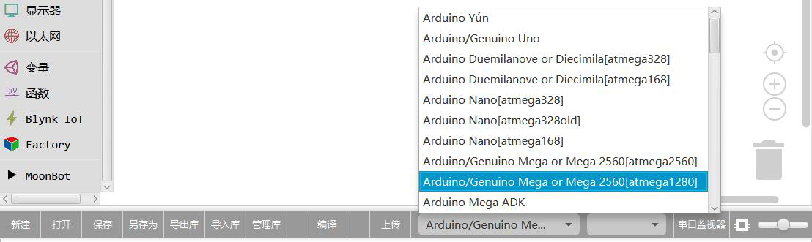

点击导入库。

选中库中名为MUVisionSensor3.xml文件，点击打开。

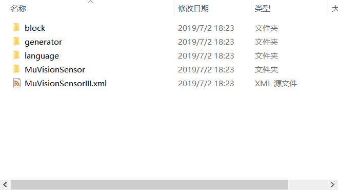

若在Mixly导航栏出现MUVisionSensor3一栏，且下方出现导入自定义库成功，则导入成功。

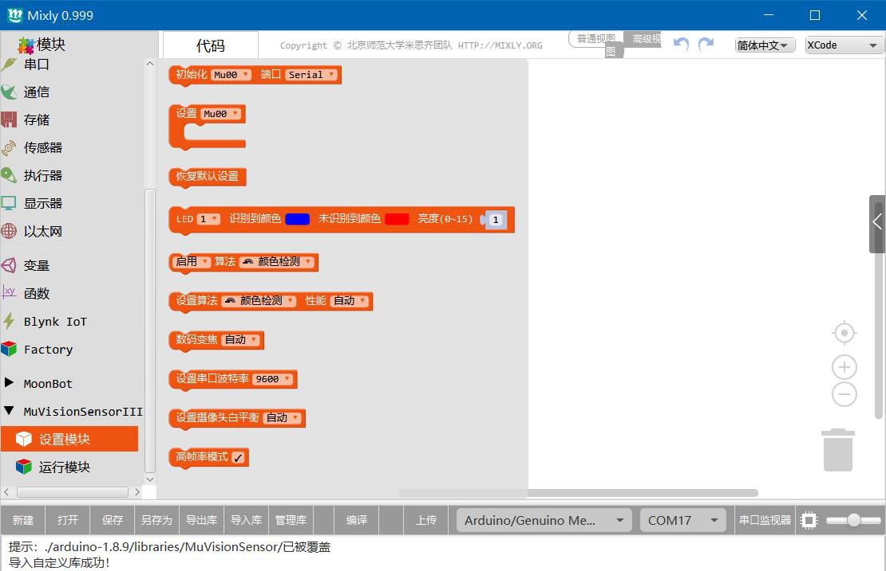

# Arduino硬件连接

MU Vision Sensor 3的外设和接口如图所示：

## I2C模式

(1)将模块左侧输出模式拨码开关1拨至下方，2拨至上方，切换至I2C模式；

(2)(不推荐修改此设置)将模块右侧的地址选择拨码开关拨至对应位(默认地址0x60，1、2都在下方)；

(3)将模块输出接口SDA口接至Arduino对应的SDA口，SCL口接至Arduino对应的SCL口。

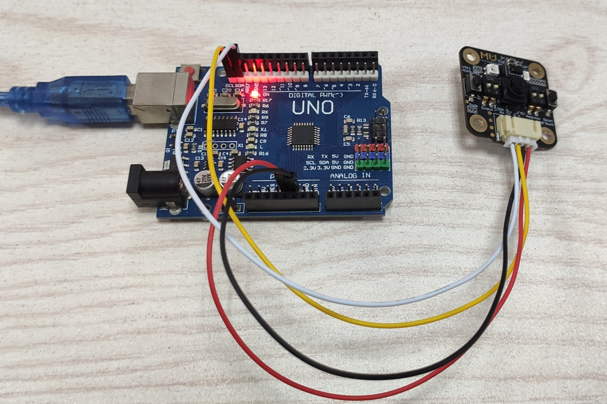

## 串口模式

(1)将模块左侧输出模式拨码开关1、2都拨至下方，切换至串口模式；

(2)(不推荐修改此设置)将模块的地址选择拨码开关拨至对应位(默认地址1、2都在下方)；

(3)将模块输出接口RX口接至Arduino对应的TX口，TX口接至Arduino对应的RX口。

## AT指令模式（适用于V1.1.5及以上版本的固件）

1）将模块左侧输出模式拨码开关1拨至下方，2都拨至上方，切换至AT指令模式；

2）将MU输出接口`RX`口接至 Arduino 对应的`TX`口，`TX`口接至 Arduino 对应的`RX`口。

## 图传模式（适用于V1.1.5及以上版本的固件）

1）将模块左侧输出模式拨码开关1、2都拨至上方，切换至图传模式；

2）将MU输出接口`RX`口接至 Arduino 对应的`TX`口，`TX`口接至 Arduino 对应的`RX`口。

# 模块使用介绍

## 模块说明

### 初始化模块

(1)硬件串口：视觉传感器使用串口模式，连接主控的硬件串口时主控初始化，该串口为主控和电脑端的串口通信，用于视觉会占用，电脑端打印字符会错乱或通信异常；

(2)软件串口：视觉传感器使用串口模式，连接主控的软件串口时主控初始化，主控可自定义RX和TX引脚，实际环境软串口速度太快可能不稳定，波特率不建议超过9600；

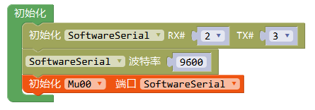

(3)硬件I2C：视觉传感器使用I2C模式，连接主控I2C引脚时主控初始化。

### 开启算法

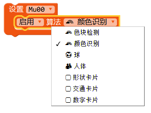

### 设置算法性能

### 开启摄像头高帧率模式

识别速度增加，同时功耗、发热量增加。

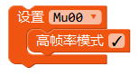

### 设置摄像头白平衡

调节因为外界光源变化而引起的图像偏色。

### 板载LED灯光设置

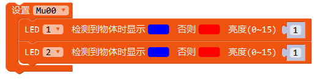

### 恢复模块默认设置
关闭所有算法，重置所有硬件设置。

### 获取算法识别结果

(1) 球、人体

(2) 卡片

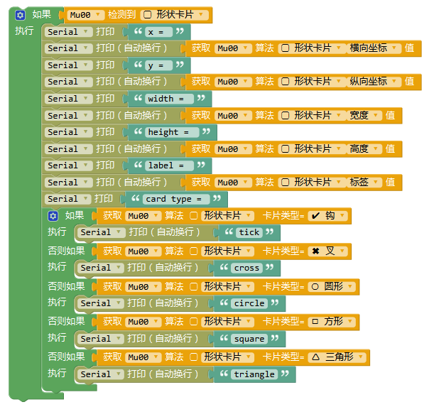

(3) 颜色识别

(4) 色块检测

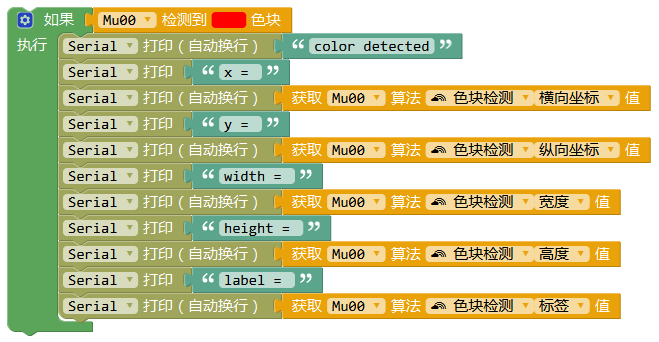

### 光线传感器启用功能

启用光线传感器中对应的功能，手势检测功能无法与其他功能同时工作。

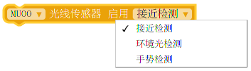

### 光线传感器设置灵敏度

设置光线传感器灵敏度，该功能只对接近检测、光线检测有效。

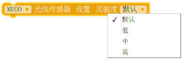

### 光线传感器读取接近检测值

读取接近检测值，距离越近，返回值越大。

### 光线传感器读取环境光检测值

读取环境光检测值，周围环境光越亮，返回值越大。

### 光线传感器是否检测到手势

读取手势检测值，当未检测到时返回0。

### 光线传感器判断手势结果

比较手势检测结果是否为某一手势。

### *WiFi AT 指令设置*

*以下模块仅在图传/AT 指令模式下使用*

### WiFi 初始化端口

初始化 WiFi 对应的端口及其波特率

### 配置 WiFi

设置 WiFi 模式及账户密码

### 连接/创建 WiFi

尝试连接/创建 WiFi，并返回当前连接状态

### 断开/关闭 WiFi

断开/关闭 WiFi

### 设置目标 IP

设置目标 IP

### 读取目标 IP

读取目标 IP

### 读取本地 IP

读取本地 IP

### WiFi 读取

读取目标 IP 发送给 MU 的消息

### WiFi 写入

向目标 IP 发送消息

## 完整示例

### 颜色识别

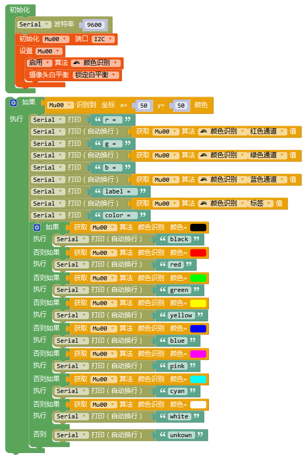

### 球体检测

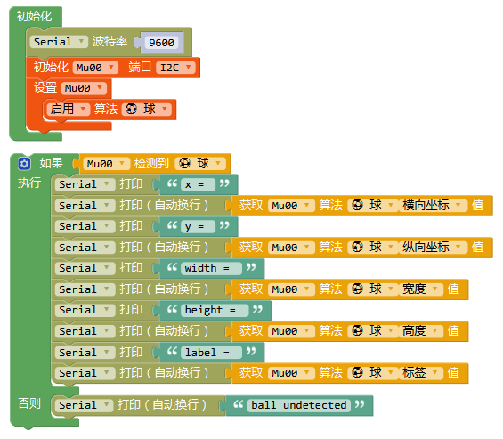

### 形状卡片检测

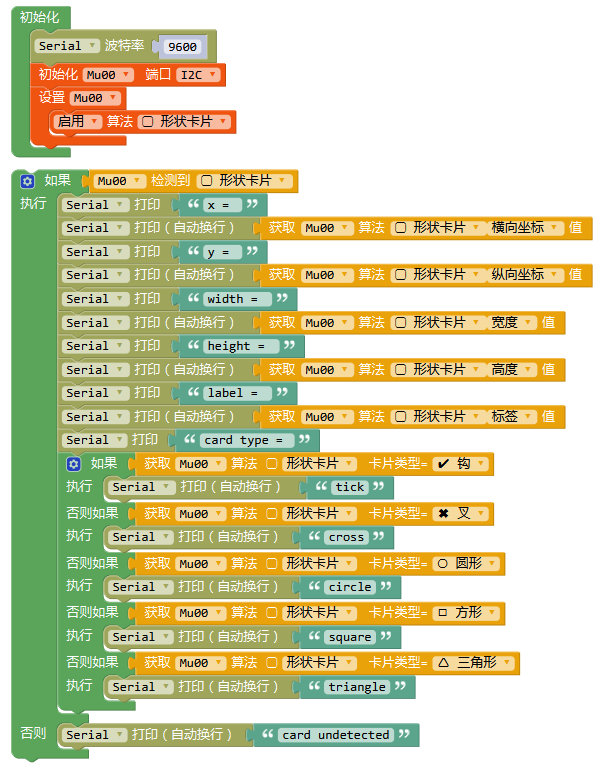

### 光线传感器-手势识别

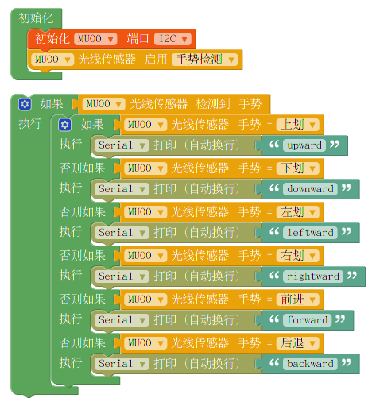

### 光线传感器-接近检测/环境光亮度检测

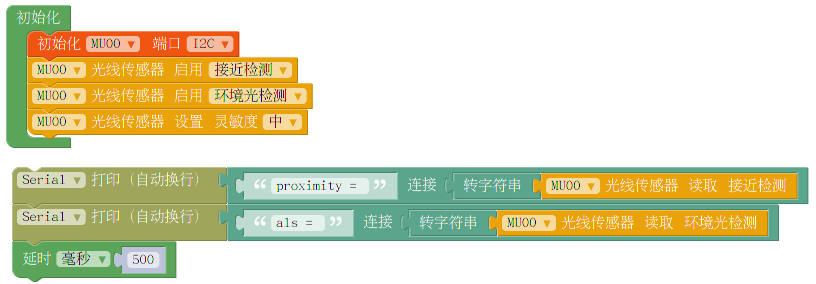

### AT指令连接WiFi

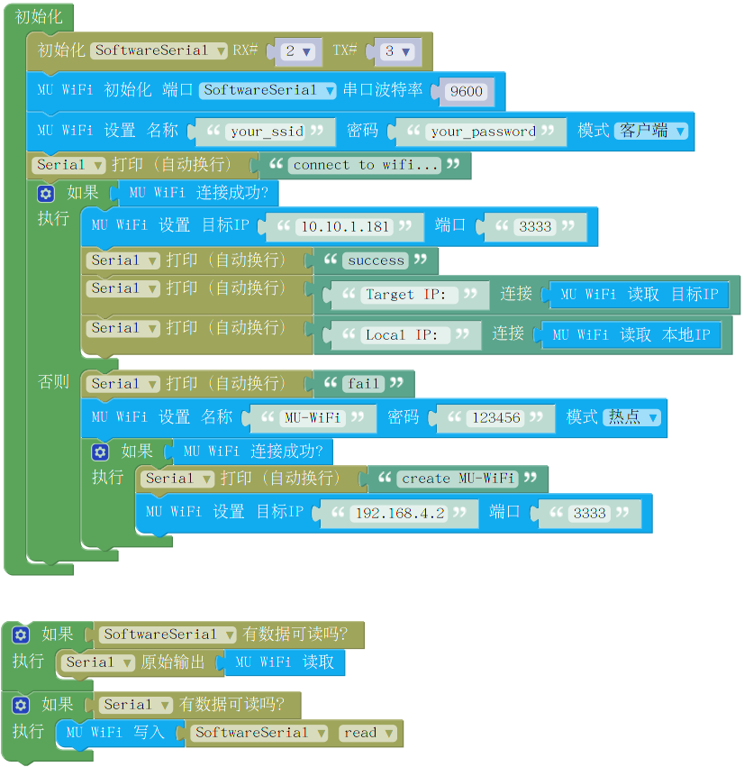

# 常见问题

1.导入库后无法打开模块或模块都是黑框怎么办？
 
请下载最新版Mixly程序，重新导入后即可。  

2.我正确导入了库，下载了例程，但是模块没有反应，串口也没有任何输出怎么办？ 
  
(1) 检查接线是否正确，是否有接触不良的现象。

(2) 检查模块背后的白灯是否常量，白灯不亮则表示电源口没有电压或电源线接线错误。

(3) 检查输出模式拨码开关和地址选择拨码开关是否是拨至正确位置。

(4) 模块从上电到初始化完成需要一段时间，建议在“设置”模块前加入一段不小于500ms的延时。
 
(5) 点击模块Reset按钮，模块正面两个LED会短暂闪烁一次光。红光则表示当前模式为串口模式，绿光则表示当前模式为I2C模式。若光的颜色与输出模式拨码开关不符，则可能为拨码开关松动，重新拨动拨码开关至正确位置即可。

3.我下载了程序，串口有正确的内容输出，但是LED灯光不亮怎么办？  

(1) 当算法为颜色识别算法时，程序默认会关闭LED，防止LED灯光照射使物体偏色。  

(2) 设置中打开LED灯光，调节灯光亮度大于0。  

4.按我对比了文档和Mixly库，发现有些功能Mixly库没有怎么办？  

为了使库易于理解和操作，在Mixly库中去除了一些不常用的功能，简化了一些参数的设置方式。若这些省去的功能影响到了您的项目，请发邮件至摩图科技售后：support@morpx.com寻求技术支持和解决方案。  

5.我发现烧录前一次程序的算法会对后一次程序的算法有影响，如：前一次烧录了颜色识别算法，后一次烧录球算法，就算没有识别到球LED也会显示识别到，而只烧录球算法则没有这种现象，怎么办？  

这是因为前一种算法在程序结束后并没有被关闭导致的，可以在设置模块时加入“恢复默认设置”模块，或重新断电拨插模块即可。  
