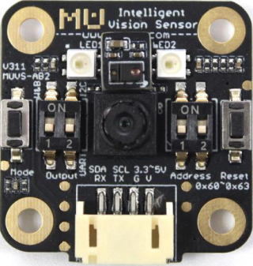

.. morpx documentation master file, created by
   sphinx-quickstart on Fri Jul 19 17:00:19 2019.
   You can adapt this file completely to your liking, but it should at least
   contain the root `toctree` directive.

MU Vision Sensor 3 简介
===============================

MU 视觉传感器3（MU Vision Sensor 3）是一款用于图像识别的传感器，其内置的深度学习引擎可以识别多种目标物体，例如颜色检测、球体检测、人体检测、卡片识别等。检测结果可以通过 UART 或 I2C 进 行输出，体积小巧，功耗低，所有算法本地处理，无须联网，可广泛应用于智能玩具、人工智能 教具、创客等产品或领域。

	
