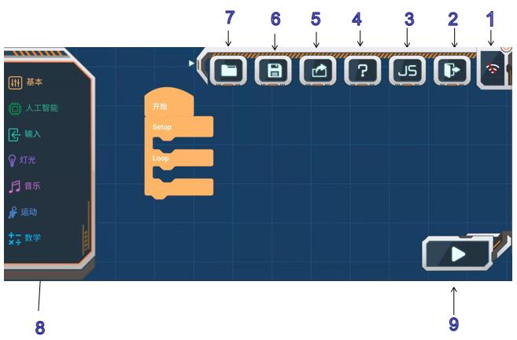
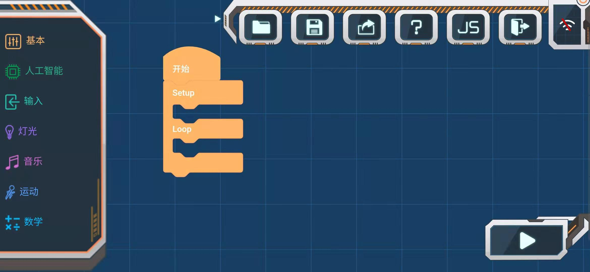
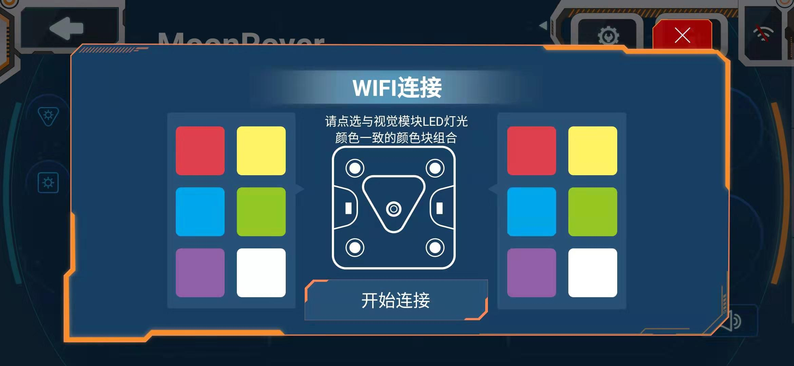
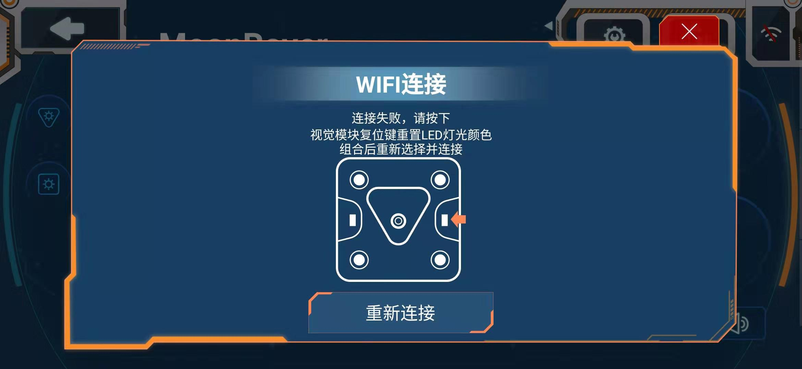

# APP自由编程

## 自由编程使用简介

1.Wifi连接
点选与视觉模块LED灯光颜色一致的颜色块组合开始连接。连接失败时，可按视觉模块复位键重新点选连接。

2.退出按钮

3.此按键待更新功能

4.帮助功能

点击会有各个功能键提示

5.分享功能

点击后可将程序分享至朋友/QQ/微信/微信朋友圈

6.项目保存功能

点击后可将程序命名后保存至我的项目中

7.我的项目

可选择自己保存好的项目打开

8.编程块

详见编程块描述

9.执行按钮

编写好程序后点击此按键执行传输

