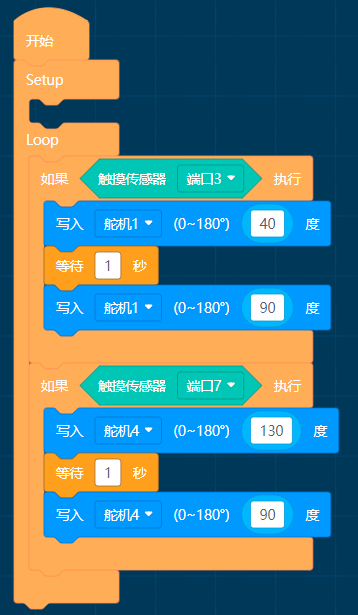
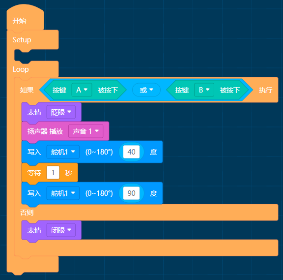

# APP示例程序

## 触摸招手

MoonBot机器人手部装有舵机，头部装有触摸传感器，可通过编程实现触摸招手

简介：循环检测触摸传感器状态，当头部左侧被触摸时，机器人招左手。当头部右侧被触摸时，机器人招右手。

## 简单算法

MoonBot机器人使用视觉传感器与眼睛灯模块

简介：循环检测球算法，当检测到球时眼睛转圈表情，未检测到时闭眼。

## 功能模块示例

MoonBot机器人使用按键扬声器LED灯舵机灯配合数学模块。

简介：循环检测按键A/B的状态，当按键被按下时，MoonBot机器人做出声音灯光手臂动作。

## 找人示例

MoonBot机器人使用视觉传感器与运动模块

简介：开启人体算法，未检测到人体时视觉传感器LED闪烁红灯，检测到时亮蓝灯。

当检测到人体位于中心时机器人停止运动，否则向左/右转动。

