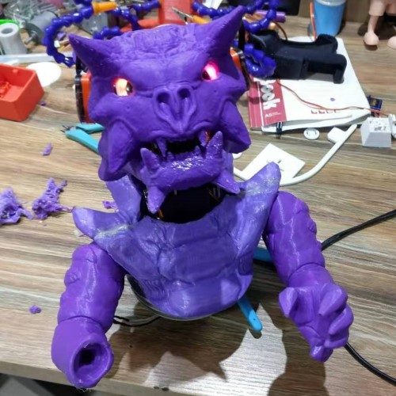
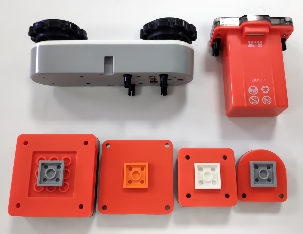
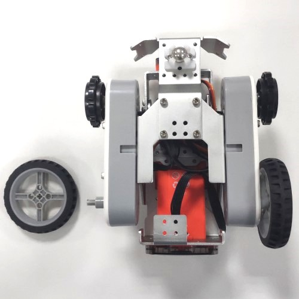
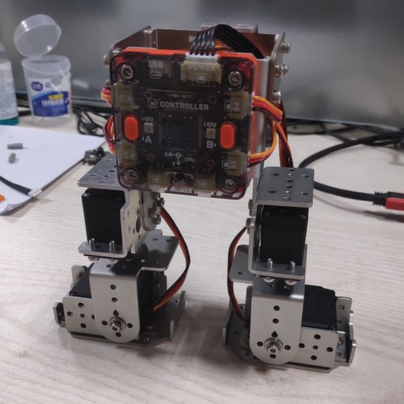

# 3D装配图
在网盘下载MoonBot Kit的三形态3D图[网盘链接](https://pan.baidu.com/s/1H0bqjfQkbCjdKpvkfHyFAg) 提取码: rans 

STP文件为通用3D格式，可用主流3D软件如solidworks,CREO打开。模型可用于查看MoonBot Kit的装配细节，测量相应尺寸，模型渲染等。
注意该模型内塑料件和钣金件均针对开模设计，不建议用于FDM 3D打印。

# 自定义外壳

MoonBot的外形可以自己制作，使用3D打印、厚纸板、木板等材料工具制作机器人外观或做内部改造。例如下图创客马老师制作的帅气龙。

# 积木小车

MoonBot套件的硬件模块可以连接常见的乐高积木，替代钣金作为结构件搭建积木机器人。

基础连接方式：乐高积木分为传统系列和插销式的technic系列，本套件中横向放置的模块使用传统接口，纵向放置的模块使用techinc接口。
传统接口的模块需转接一块2X2的乐高块，就可以和连接到其他积木块；technic接口的模块则使用插销来连接到其他technic块,如图所示。

将电机模块主动轮的螺丝卸下，移除主动轮，换上一个TT马达转乐高的十字转接头，就可以使用乐高轮制作一个传统的两轮小车了。
在前面安装一个万向轮以支撑小车，维持水平，如图所示。换成两轮小车后速度可以达到原本履带小车的两倍以上。

# 双足机器人

MoonBot主控最多可以连接4个舵机，配合钣金件可搭建一台双足跳舞机器人。

