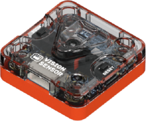
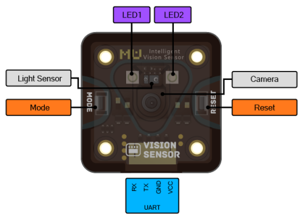
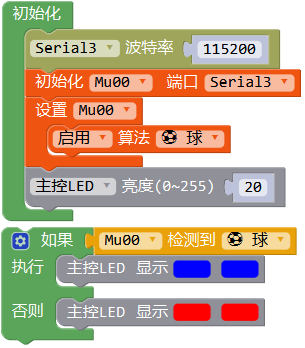
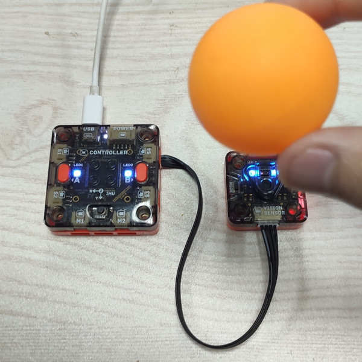
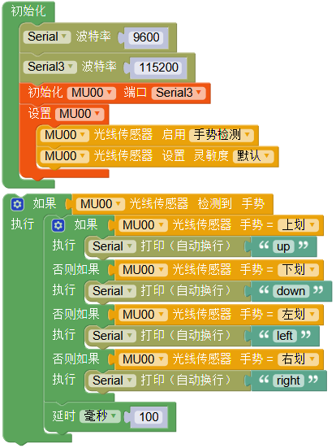

# 视觉模块

## 简介

视觉模块是一个带有特定视觉算法的识别模块。

模块与主控之间通过串口连接，通过主控编程控制视觉模块数据传输，也可通过wifi连接手机端app实现远程编程功能。

## 参数

尺寸：37 x 37 x 15 mm

主控芯片：[ESP32](./sources/datasheet_esp32_cn.pdf)

摄像头：[OV7725](./sources/datasheet_OV7725_en.pdf)

视角：85°

光线传感器：[APDS9960](./sources/datasheet_APDS-9960_en.pdf)

板载资源：按键、LED指示灯

连接方式：UART、wifi

接口：PH2.0 4P

### 接口图

## 使用示例

### 串口开发

视觉模块可和主控连接，通过主控编程使用指令控制决定视觉模块的识别功能，并通过串口向主控传输数据。

硬件连接：将视觉模块连至主控P9口，作为UART3(Serial3)串口设备运行。

程序介绍：在初始化中开启主控和视觉模块间串口Serial3，波特率默认115200，初始化视觉模块至Serial3，启用球检测算法。
循环程序中，将主控的亮灯状态配置为和视觉模块的灯相同，即检测到球亮蓝灯，未检测到球亮红灯。

实验现象：先按视觉模块的RESET键初始化视觉模块，板载两个LED灯会常亮进入等待指令状态，然后初始化主控，主控的初始化程序就向视觉模块发送指令，
此时视觉模块进入检测球状态，两个灯闪红色，此时主控进入循环接收状态。当检测到球时，主控和视觉模块的LED都亮蓝色。

实物图：

> 注意MoonBot视觉模块和MU视觉传感器的区别，视觉模块默认和主控采用串口连接，使用Mixly或Arduino进行开发，且独有wifi连接MU Bot App的功能，初始化程序参考以上示例。

该程序较为简单，主要为了展示视觉模块的连接和程序初始化。更多编程块和示例程序可参考

[MU 3 Mixly 教程](https://morpx-docs.readthedocs.io/zh_CN/latest/MUVS3/MUVS3_Mixly/index.html)

### wifi连接app

视觉模块自带wifi，可以连接MU Bot App，进行遥控或手机端编程等，详情参考

[MoonBot Kit MU Bot App 教程](https://morpx-docs.readthedocs.io/zh_CN/latest/MoonBot/MoonBot_App/index.html)

### 光线传感器

在最新版本视觉模块的固件中，加入了板载光线传感器的控制功能。该光线传感器为红外传感器的点阵，可以测得环境光强度，或用红外测距判断前方物体的移动信息，即可以识别挥动手势。
以下示例展示视觉模块的手势识别功能。

硬件连接：同上

程序介绍：初始化中开启串口Serial和Serial3，Serial用于主控和PC通讯，Serial3用于主控和视觉模块通讯。启用光线传感器的手势检测功能。
循环程序中，循环检测手势，若识别到手势，则判断具体的手势类型并通过串口发送至PC。

实验现象：本示例未使用视觉算法，所以初始化视觉模块后板载LED未开启。打开Mixly的串口监视器，当手在视觉模块前约20cm处划过时，串口打印手划过的方向，就是此时的挥动手势。

