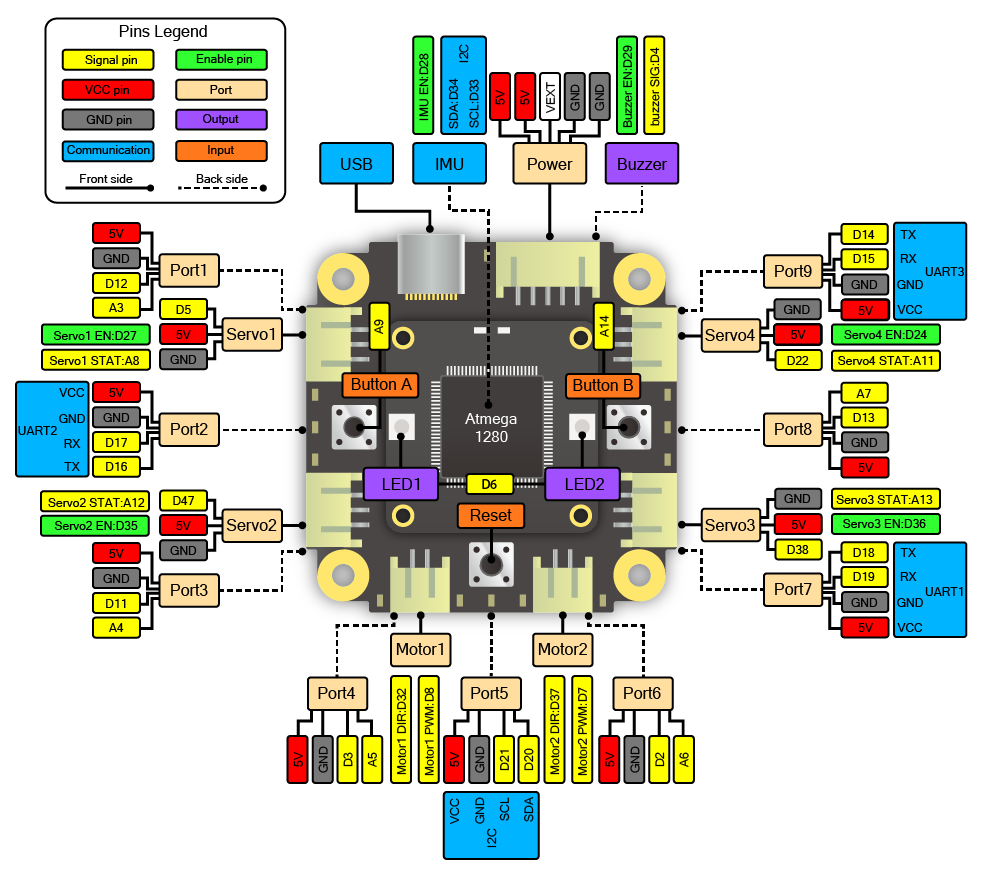
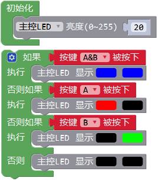

# 主控模块

## 简介

主控模块是机器人的交互核心。

## 参数

尺寸：53 x 53 x 17.6 mm

主控芯片：ATmega1280

接口：4路舵机、2路电机、9路通用输入输出

板载资源：按键、LED指示灯、蜂鸣器、电子罗盘、加速度计

**外设和接口图：**

## 使用示例

**主控LED和按键示例**

程序介绍：该程序是通过主控模块板载的2个可编程按键控制板载的2个RGB彩灯。

循环检测按键A和按键B的状态，当A被按下时LED1亮红色，当按键B被按下时LED2亮绿色，之后关闭LED。

**主控蜂鸣器示例**

程序介绍：该程序介绍主控蜂鸣器的编程方法，用两种方式让蜂鸣器发出警报声。

设置蜂鸣器的节拍为BPM 120，即每1拍为0.5秒。蜂鸣器可以直接播放已定义的音调，或者直接播放频率，注意播放频率时需要加上延时，否则会被跳过。

循环播放5次高低警报音后停止播放，结尾添加死循环防止再次播放。

**主控IMU示例**

IMU(Inertial Measurement Unit)是指惯性测量单元，含有陀螺仪、加速度计、指南针等一种或多种传感器，主要用于测量当前姿态，常用于无人机、机器人等设备。
主控模块的IMU含有加速度计和指南针，并带有温度补偿，可以通过这些传感器反馈知道机器人当前是否有翻倒、跌落、震动等状态。以下示例简单介绍主控的IMU使用方法。

程序介绍：