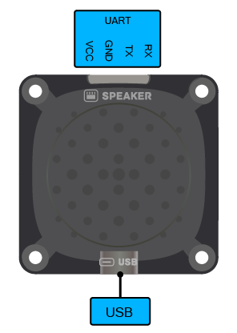
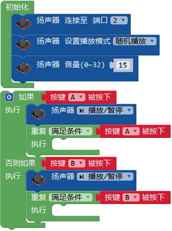
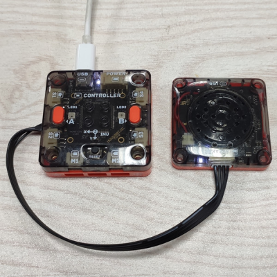
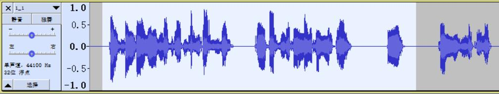

# 扬声器模块

## 简介

扬声器模块是一个通过串口指令控制的mp3模块，可通过USB-C口连接电脑放入mp3声音文件，后通过主控控制播放。

## 参数

尺寸：48 x 48 x 11.6 mm

输出功率：1W

支持文件：mp3

存储空间：16MB

接口：PH2.0 4P, USB-C

### 接口图

## 使用示例

### 按键控制播放

扬声器模块可与主控连接，通过主控控制播放内置语音。

程序介绍：让扬声器随机播放预置音乐，通过按键使其暂停/播放。
将扬声器连接至主控口，设置播放模式为随机播放，自定义扬声器音量大小，循环检测按键A的状态，当A被按下时，扬声器播放/暂停。

实物图：

### 音频导入

#### 音源获取

扬声器模块通过播放音频文件使机器人发声。音频文件来源可以是：

1. 直接录音
2. 文字转语音(TTS)软件

直接录制的声音会更生动，在特定的场景中会让机器人更有亲和力，如待人接物的服务机器人；而文字转语音制作的声音用于各类AI助手，更标准通用，在问答机器人等交互场景中更加适合。

#### 音频处理

为了使机器人的发声更加合理，将原始的语音处理后再放入扬声器模块。比如截取片段，标准化音量，改变音高，压缩大小等操作。

这里使用免费的[Audacity](https://www.audacityteam.org/)软件处理音频。在顶栏菜单中的文件-导入-音频导入原始音频，可看到音频的频谱。

#### 截取片段

在语音中停顿时间过长或者只需要部分语音时，可通过截取片段裁剪语音。拖动选取语音段，
**ctrl+c**后**ctrl+v**复制到另一条音轨或使用**delete**删除。

#### 标准化音量

在录音文件中常会出现音量大小不一的问题，可通过效果-标准化来调节声音的振幅。

#### 改变音高

为了使机器人的声音与人声区别开，可通过效果-改变音高来调节声音风格。将人声音高增加30%-40%会更接近MoonBot的说话风格。

#### 压缩大小

扬声器模块有16 MB的存储空间，使用mp3格式的压缩音频文件，通常可存储上百个文件。影响音频文件大小的主要是采样率和输出比特率。当音频文件数量多、时间长时，可通过调节项目采样率至22050，导出MP3格式选择质量中等，145-185 kbps，勾选强制输出到单声道等操作有效降低文件大小。

#### 文件导入

扬声器模块可以直接用USB-C线连接电脑，作为模拟U盘来存放音频文件，需要将音频文件重命名来调用。扬声器模块可以指定根目录文件名的前4位进行播放。例如根目录下T002_ask.mp3音频文件，在米思齐中通过编程块调用扬声器播放T002即可播放该文件，并可加入按键控制等方式切换或暂停。

