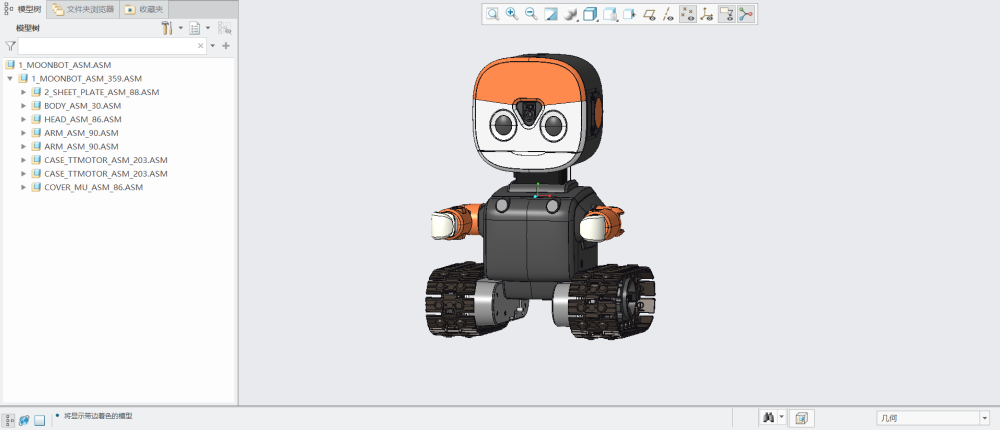

# 技术资料

在以下网址可获取最新的MoonBot Kit技术资料：

官网技术支持：<http://mai.morpx.com/page.php?a=moonbot-kit>

GitHub：<https://github.com/mu-opensource/>

# 3D装配图

在此下载MoonBot Kit的三形态3D图：

[MoonBot Kit 3D 装配图](https://github.com/mu-opensource/Morpx-docs/raw/master/MoonBot/MoonBot_Resource/sources/MoonBot_Kit_asm.zip) 

STP文件为通用3D格式，可用主流3D软件如solidworks，CREO等打开。模型可用于查看MoonBot Kit的装配细节，测量相应尺寸，Keyshot模型渲染等。
注意该模型内塑料件和钣金件均针对开模设计，不建议用于FDM 3D打印。

# 平台链接

MoonBot Kit兼容Arduino开源平台，查看其相关网站来学习基础知识。

**Mixly:**

Mixly官网 <http://mixly.org/>

Mixly帮助文档 <https://mixly.readthedocs.io/zh_CN/latest/contents.html>

**Arduino：**

Arduino官网 <https://www.arduino.cc/>

Arduino中文社区 <https://www.arduino.cn/forum.php>

DF创客社区 <http://mc.dfrobot.com.cn/>

极客工坊 <https://www.geek-workshop.com/forum.php>
