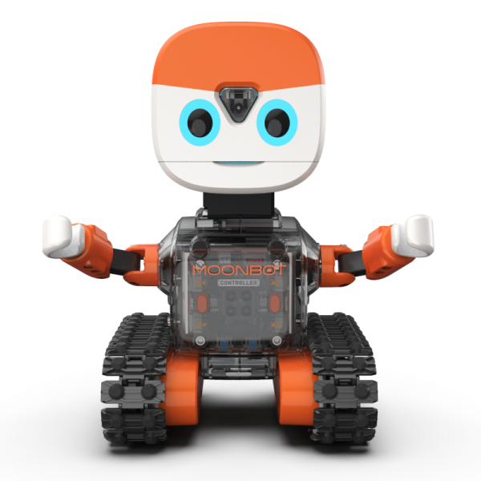

# MoonBot 指南

## 介绍

MoonBot是一台具有丰富的传感和交互的半人形机器人。主体由钣金骨架配合塑料外壳搭建而成，使用履带底盘整体移动，头部、手部则使用舵机实现转动。
通过触摸、视觉、方位的反馈，眼睛和扬声器等都可作出交互。

MoonBot可用于学习接待、巡逻等服务型机器人应用。

## 参数

尺寸：150 x 137 x 216 mm

功能

动作：头部 手臂 底盘

交互：眼睛 喇叭

传感：视觉 触摸 测速

## 搭建指南

下载MoonBot pdf搭建指南

[MoonBot 搭建指南](https://github.com/mu-opensource/Morpx-docs/raw/master/MoonBot/MoonBot_Structure/docs/MoonBot_Manual_20190729.pdf)

## 示例程序
