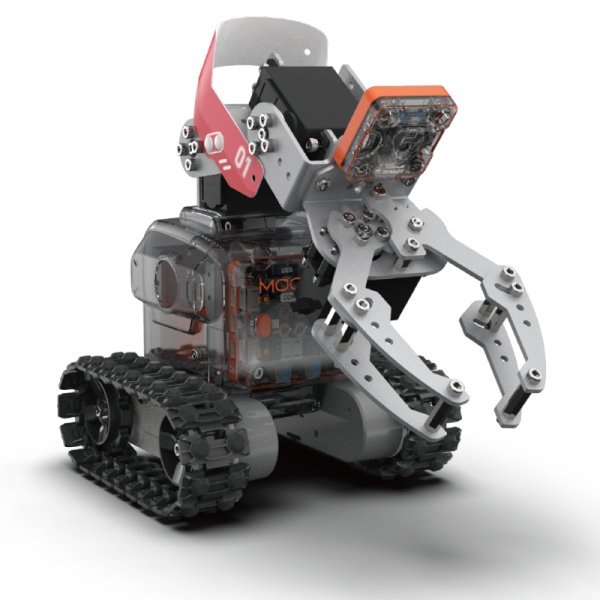

# MoonMech 指南

## 介绍

MoonMech是一台可移动的机械臂。底盘和人型类似，由塑料外壳包裹钣金骨架搭建而成。整体移动依靠底部履带底盘，机械臂的角度和调节则依靠两个舵机。前置机械爪配合视觉反馈可以夹持各种物体。

MoonMech可以用于学习工厂搬运、投篮等工程和竞技类应用

## 参数

尺寸：271 x 137 x 244 mm

功能

动作：机械臂 机械爪 底盘

传感：视觉 测速

## 搭建指南

下载MoonMech pdf搭建指南

[MoonMech 搭建指南](https://github.com/mu-opensource/Morpx-docs/raw/master/MoonBot/MoonBot_Structure/docs/MoonMech_Manual_20190729.pdf)

## 示例程序
