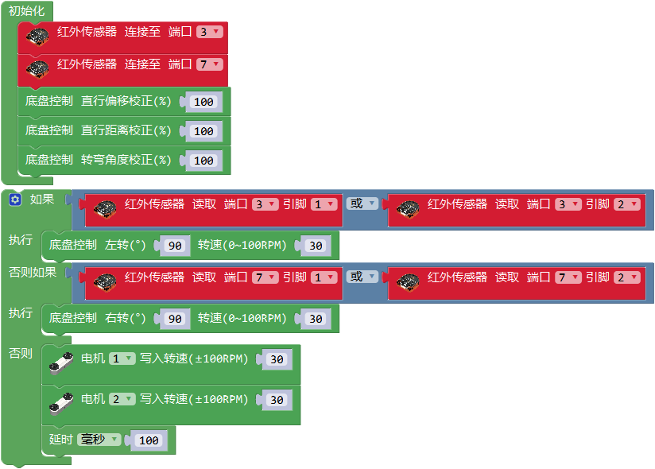

# MoonRover 指南

## 介绍
MoonRover由钣金车身和硬件模块组成。智能车整体运动由履带底盘驱动，顶部安装主控连接各外设，前面和底部可安装避障、视觉等传感器，后部安装电池。

MoonRover可以用于学习避障、巡线、无人驾驶等车类应用。

## 参数

尺寸：177 x 157 x 87 mm

功能

动作：头部 底盘

传感：视觉 避障 测速

## 搭建指南

下载MoonRover pdf搭建指南或观看MoonRover搭建视频，包括基础搭建部分和拓展部分。

[MoonRover 入门指南](https://github.com/mu-opensource/Morpx-docs/raw/master/MoonBot/MoonBot_Structure/docs/MoonRover_quick_start_guide_cn.pdf)

[MoonRover 搭建扩展](https://github.com/mu-opensource/Morpx-docs/raw/master/MoonBot/MoonBot_Structure/docs/MoonRover_extended_cn.pdf)

[MoonRover 搭建视频](https://v.qq.com/x/page/z09275wx0vl.html)

## 示例程序

下载MoonRover米思奇示例程序

[MoonRover 示例程序](https://github.com/mu-opensource/Morpx-docs/raw/master/MoonBot/MoonBot_Structure/sources/Mixly_example_MoonRover.zip)

### 避障小车

智能车前面安装了两个红外避障模块后可以成为一台避障小车。

硬件连接：搭建好小车的基础形态，如顶部图所示。车右边的红外模块连至端口P3，左边的红外模块连至P7，红外模块需全部切换至远距离模式。

程序介绍：初始化设定两个红外传感器的连接口，设定底盘的校正。
循环程序为三种运行状态，当右边的传感器检测到障碍后则底盘左转，当左边的传感器检测到障碍后则底盘右转，未检测障碍则直行。

### 自动驾驶小车

智能车前面安装了视觉和调节视觉角度的舵机后就成为一台可以用视觉导航的自动驾驶小车。

硬件连接：按照MoonRover入门指南完成小车的搭建，注意视觉模块连接在P9口。

程序介绍：初始化设定视觉模块在串口3（P9口)，启用算法交通卡片，底盘校正。
循环程序中视觉模块检测交通卡片，5种交通卡片对应5种小车运动状态，如果检测到相应的卡片则对应运动。

实验现象：烧录程序后打开电池开关，视觉模块初始化完成后闪红灯进入检测状态，将前进卡片放在小车前20厘米左右处即可被识别，小车前进。
在运动过程中小车可以检测到其他卡片切换运动状态。在小车运动道路上立好不同的卡片让小车自动驾驶吧。

