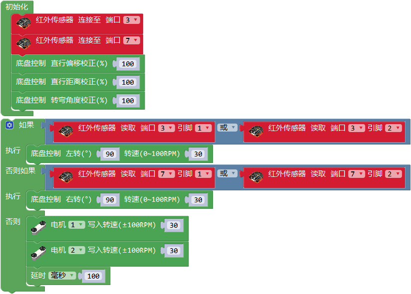

# MoonRover 指南

## 介绍
MoonRover由钣金车身和硬件模块组成。小车整体运动由履带底盘驱动，顶部安装主控连接各外设，前面和底部可安装避障、视觉等传感器，后部安装电池。

MoonRover可以用于学习避障、巡线、无人驾驶等车类应用。

## 参数

尺寸：177 x 157 x 87 mm

功能

动作：头部 底盘

传感：视觉 避障 测速

## 搭建指南

下载MoonRover pdf入门指南

[MoonRover 入门指南](https://github.com/mu-opensource/Morpx-docs/raw/master/MoonBot/MoonBot_Structure/docs/MoonRover_Get_Started_20190729.pdf)

## 示例程序

### 避障小车

小车前面安装了两个红外避障模块后可以成为一台避障小车。

硬件连接：搭建好小车的基础形态，如顶部图所示。车右边的红外模块连至端口P3，左边的红外模块连至P7，红外模块需全部切换至远距离模式。

程序介绍：初始化设定两个红外传感器的连接口，设定底盘的校正。
循环程序为三种运行状态，当右边的传感器检测到障碍后则底盘左转，当左边的传感器检测到障碍后则底盘右转，未检测障碍则直行。

