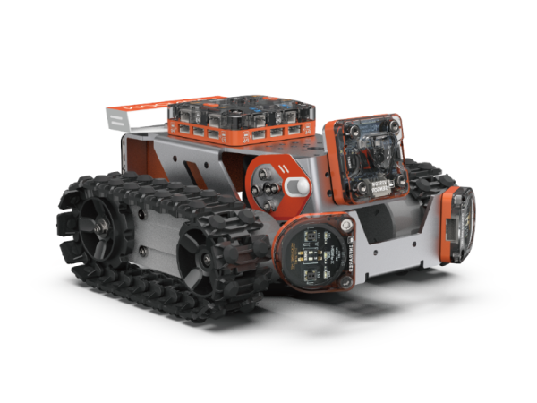

# MoonRover 指南

## 介绍
MoonRover由钣金车身和硬件模块组成。小车整体运动由履带底盘驱动，顶部安装主控连接各外设，前面和底部可安装避障、视觉等传感器，后部安装电池。

MoonRover可以用于学习避障、巡线、无人驾驶等车类应用。

## 参数

尺寸：177 x 157 x 87 mm

功能

动作：头部 底盘

传感：视觉 避障 测速

## 搭建指南

下载MoonRover pdf入门指南

[MoonRover 入门指南](https://github.com/mu-opensource/Morpx-docs/raw/master/MoonBot/MoonBot_Structure/docs/MoonRover_Get_Started_20190729.pdf)

## 示例程序
