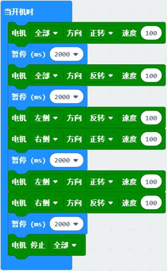
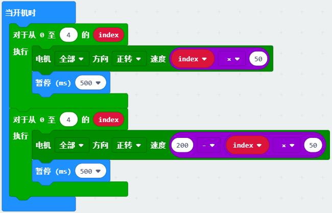

# 执行器类教程

执行器是接受控制信号并对受控对象施加控制运行作用的装置。作为输出类设备，通常用顺序控制就可以使执行器动起来。
通过相应的编程块来掌握以下执行器的直接控制。

## 电机控制

电机(motor)俗称马达，是常见的电能转换为机械能的装置。电机可划分为直流、交流，有刷、无刷，永磁、电磁等很多种类。小车常用直流减速电机作为车轮的驱动电机。
通过控制左右轮的速度、方向即可实现小车向各个方向的运动。

**示例一：**让小车分别前进、后退、左转、右转、停止，每个动作持续2秒。

程序说明：通过控制两个电机运动方向实现小车方向的变化。

**示例二：**小车加速启动后减速停止。

程序说明：使用循环控制电机速度依次增加，电机速度从50增加到200，再减到0。

## 舵机控制

舵机(servo)是一种简单的伺服电机，常用在车模、船模、机器人等产品，用于掌舵控制方向。舵机内部采用直流电机驱动，多级齿轮减速器产生大扭矩，电位器确定当前角度。
用PWM信号控制舵机转到指定角度即可让舵机快速转到某个角度后保持不变。

示例：控制舵机

## 灯光控制

单灯（车灯），microbit点阵，串行灯（氛围灯）

## 音乐控制

蜂鸣器
