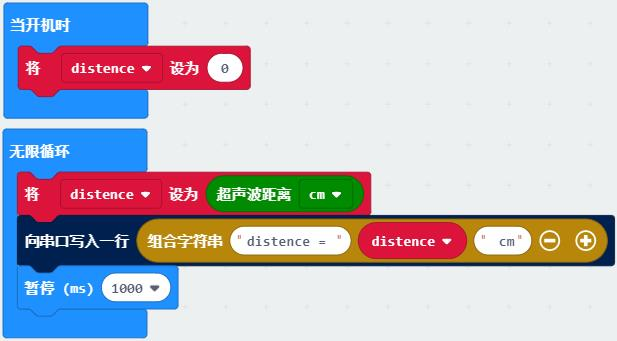

# 通讯类教程

在实际的设备与设备间、芯片与芯片间往往有各种通讯协议(protocol)，用于传输复杂的数据，本质是按照预定的规则收发数据。
在可视化编程中部分收发规则已简化，配置了默认的引脚、格式，而内部的数据类型、字符的协议需要用户自己定义。

## 串口

串口通讯（Serial Communication)是设备间常用的串行通讯方式，比如micro:bit与电脑间就可以通过串口收发数据。
串口常用于程序的调试环节，可以将程序中的数据配合一些解释通过串口打印在电脑上。
串口设备接入电脑后会显示相应的COM口，在此电脑右键左侧设备管理器中可以找到。

**示例一：串口打印数据**

程序说明：用串口替代micro:bit的点阵来显示超声波测距数据，打印在控制台上。
用变量distence记录超声波测距的值，串口打印描述性的语句和distance的值来显示数据。
在编程界面左侧打开“显示控制台 设备”即可看到串口返回的信息。

**示例二：串口收发**

程序说明：micro:bit与电脑间互相收发。

## 无线通讯

两块microbit之间遥控

## 蓝牙
