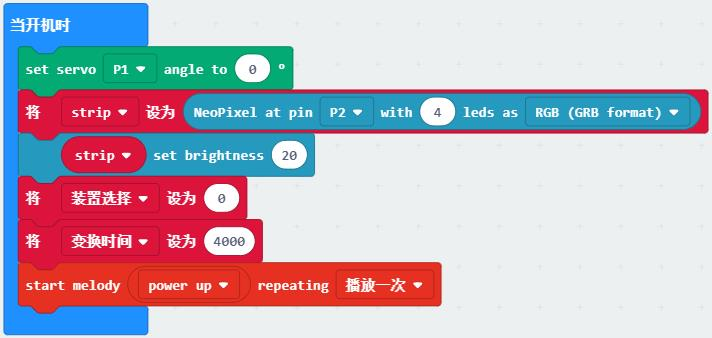
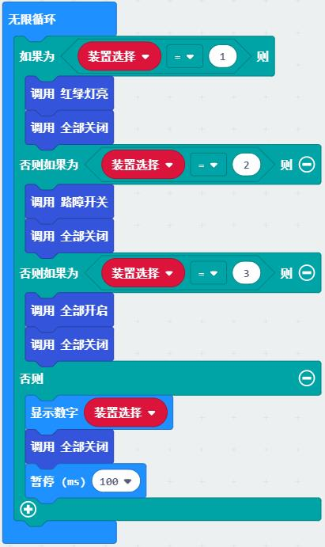
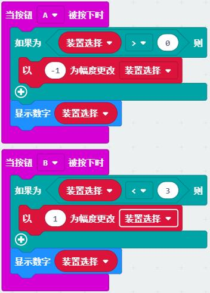
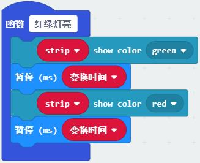
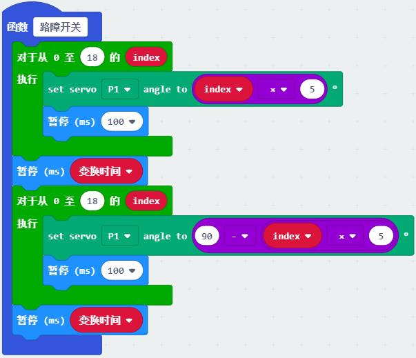
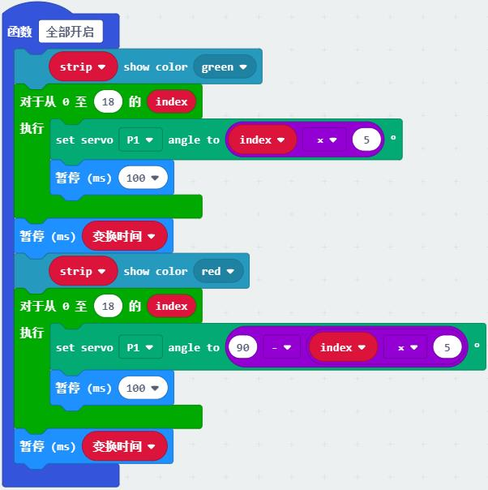

# 综合运用教程

## 交通控制器

交通控制器中micro:bit主控和扩展板作为主控，电池作为供电，舵机和交通灯作为输出，
是舵机、交通灯、GPIO的综运用示例。

程序说明：

1. 当开机时，设定舵机连接口P1和交通灯连接口P2，初始化用到的变量。

2. 无线循环主程序中，检测变量“装置选择”的数值，启用相应功能。

3. 通过按键中断对“装置选择”进行修改，且约束在0-3之间。

4. 各个功能函数，点亮红绿灯，转动舵机，全部开启和全部关闭，可以被主程序调用。

## 单线道路自动驾驶

单线红外巡线

竖立路牌识别：交通卡片指示牌、数字卡片限速、颜色识别红绿灯

## 道路内自动驾驶

道路中颜色识别道路范围寻路

识别地上交通卡片，道路标识

## 遥控 巡线综合

遥控移动到指定位置后切换至自动运动
