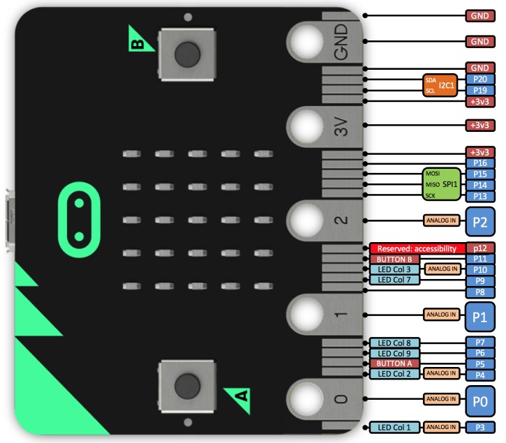

# 硬件高级教程

在Makecode中很多默认硬件相关的编程已做简化，而在使用外接设备时，比如插入扩展板，就涉及到引脚的相关控制。
在使用麦昆小车时就会涉及到引脚的精确使用，如蜂鸣器接在P0脚。
通过硬件相关的系统学习，在使用micro:bit外接传感器或执行器时就能如鱼得水，自由设计。

## GPIO

通用输入输出端口（GPIO）是主控芯片提供的可供编程的接口，对应着芯片上的各个引脚。
在micro:bit中有部分引脚已被系统使用，留出的引脚可供用户编程。在高级-引脚里可以看到引脚P0-P20中的部分可以使用。
而板载的按键、LED等外设（外部设备的简称）同样也用到了其中部分引脚。

micro:bit引脚图：

可以看到micro:bit可用的引脚已经通过金色的金手指引出，在套件中配了一块扩展板，则能将金手指转换成排针，方便连接舵机、LED等外部设备。

扩展板接口图：

## ADC

## DAC

## PWM

UART IIC SPI
