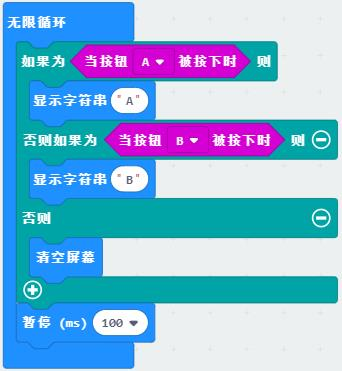
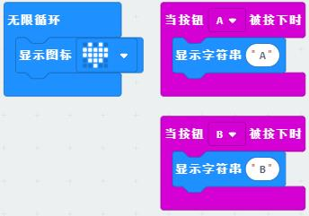
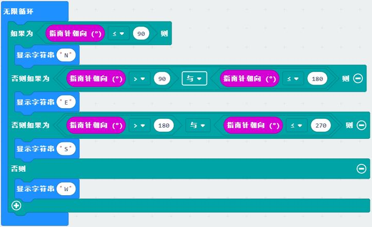

# 传感器类教程

传感器（sensor）是一种检测装置，能将测量到的信息，转换为电信号输出。对于主控来说传感器主要是输入设备，在自动控制中起重要作用。
传感器的类别非常多，功能和数据也各有不同。本教程通过micro：bit相关传感器的使用来表达反馈控制的过程，见微知著。

## 按键

按键是最简单的输入设备，也可以当做是一种传感器。按键主要有通断两种状态，对应程序中的真或假、0或1，通过两种状态的检测判断产生反馈，做出相应反应。
实际生产生活中还有触摸按键、红外按键、人体红外开关、限位开关等各类按键的变种，控制方式和普通按键也有很多类似之处。

**示例一：获得按键状态**

程序说明：通过条件逻辑检测按键的状态，如果按键A被按下则屏幕显示A，如果按键B被按下则屏幕显示B，否则不显示，每0.1秒检测一次。

**示例二：中断事件**

程序说明：中断是独立于初始化和无限循环的另一种状态，由某种状态触发，如本例中的当按键被按下。程序在执行完中断程序后会回到原来的位置。
本例中主程序为显示爱心，中断程序为A或B被按下时切换显示A或B，之后回到循环继续显示爱心。

## 指南针

指南针也称为地磁传感器，能够感应地球磁场并输出当前角度。

**示例：电子指南针**

程序说明：通过micro:bit板载的指南针获得当前的角度，用屏幕显示东(E)西(W)南(S)北(N)。
将micro:bit平放转动即可看到角度。指南针初次使用需校准，翻转micro:bit将点阵全部点亮即可。

程序扩展：加入东北、东南、西北、西南，使指南针更丰富。

## 加速度计

和指南针类似，加速度计也是一种惯性测量单元（IMU），可以测得当前多个方向的加速度值。

## 超声波避障

## 红外巡线
