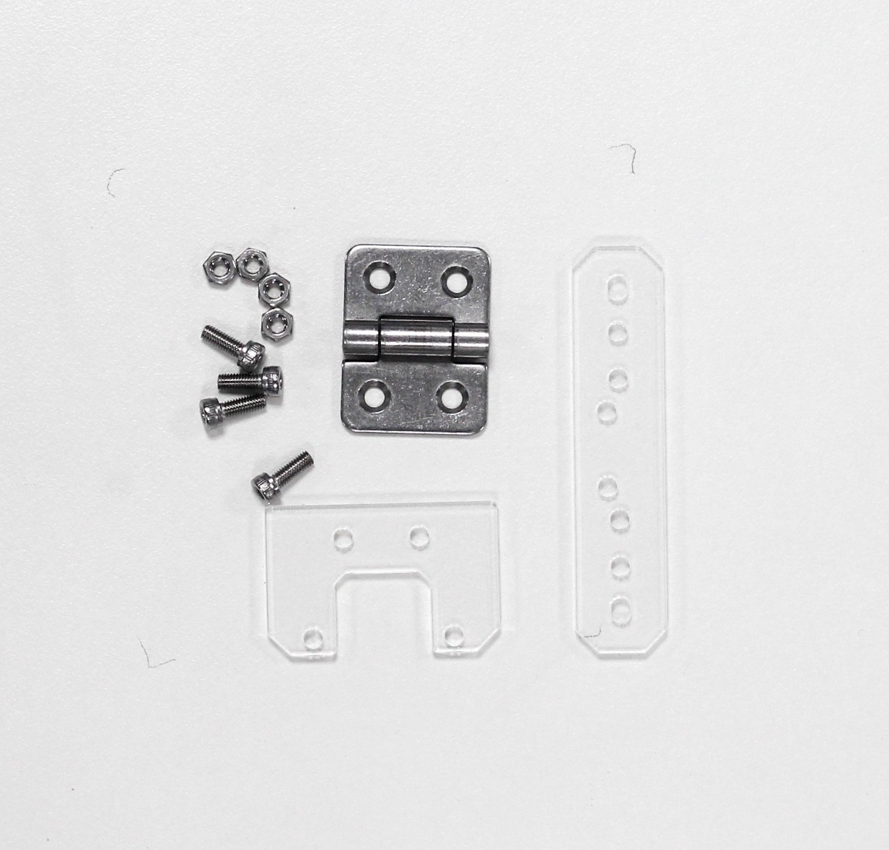
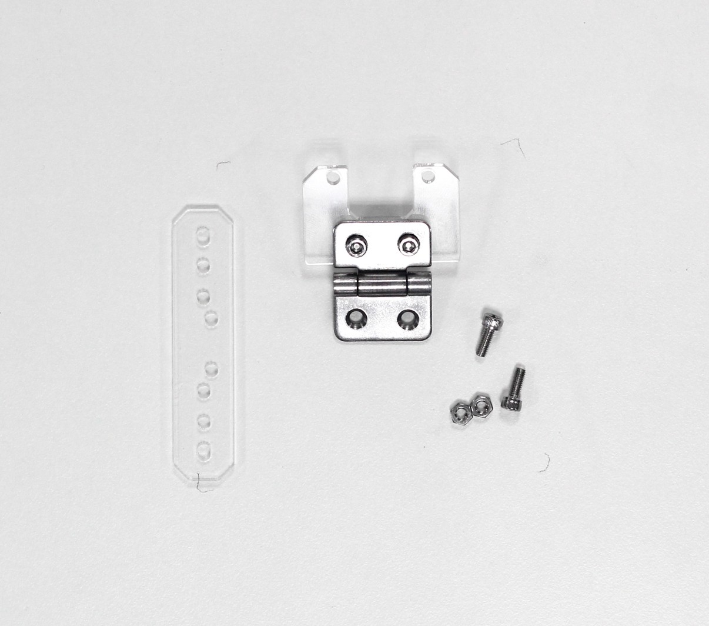
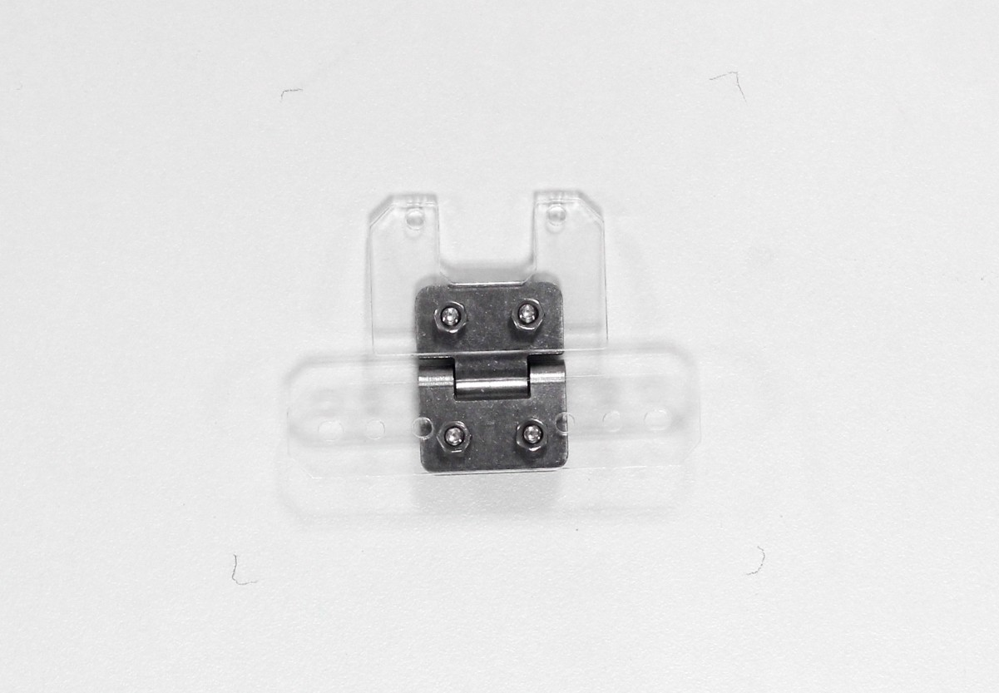
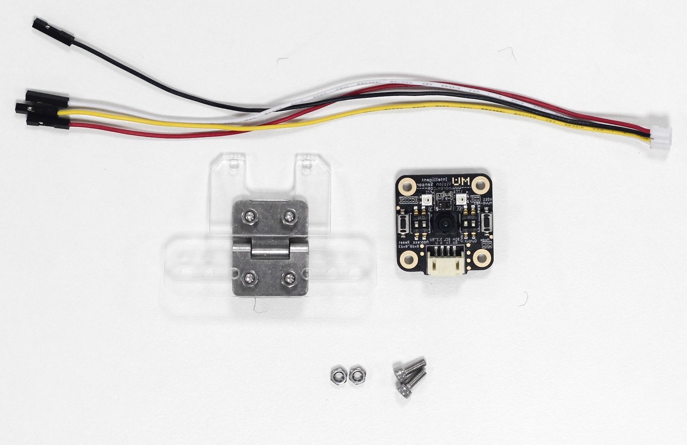
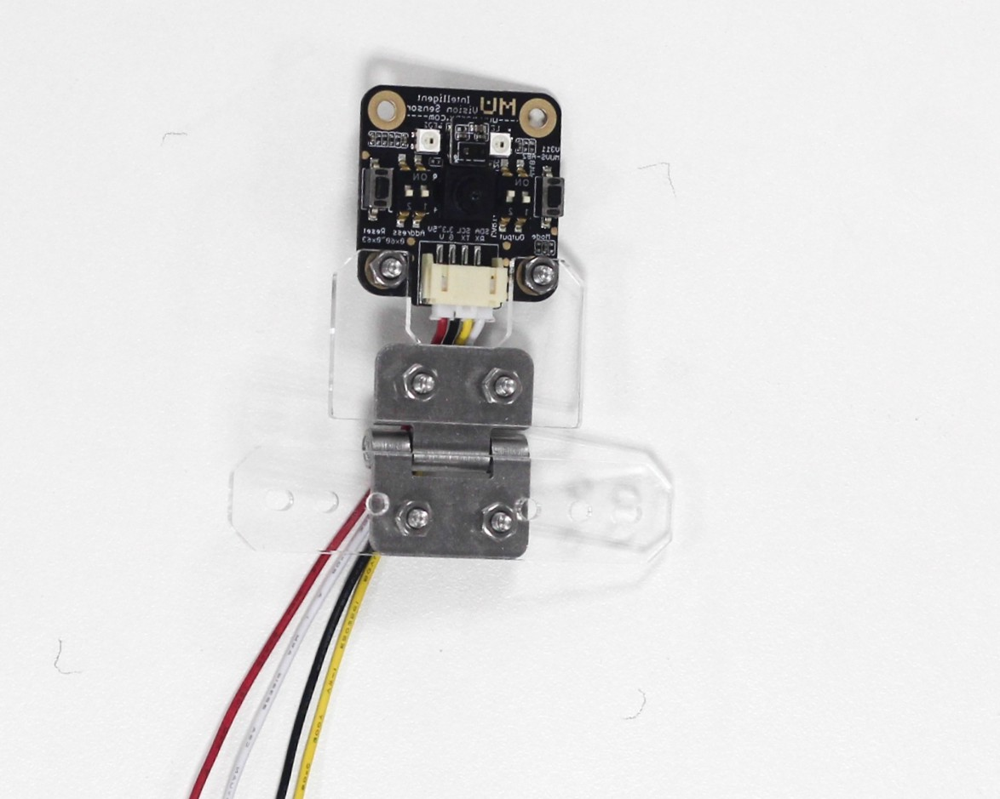
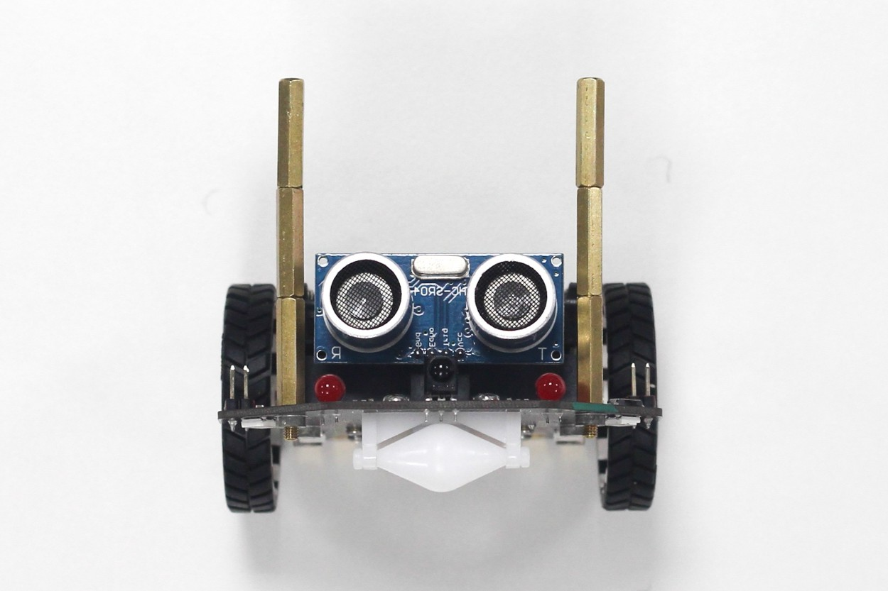
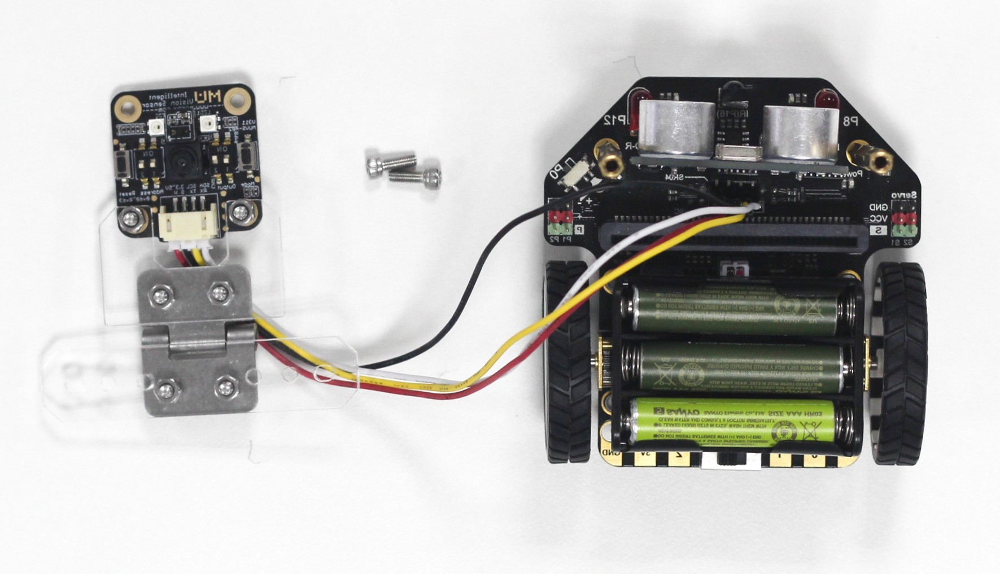
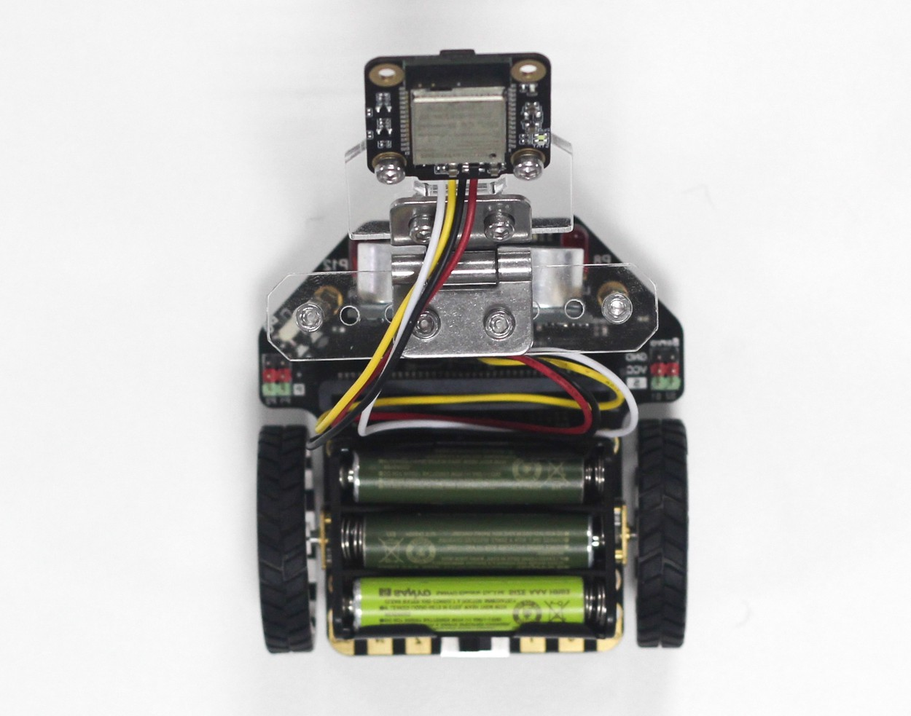

# 麦昆小车扩展

无人驾驶小车需要在麦昆小车上安装MU3视觉传感器，用于识别线和交通指示牌。
以下为参考安装教程，用户也可根据自身需要发挥创意。

1.准备金属转轴组件的相关零件。

2.连接金属折页和亚克力支架。

3.准备MU视觉传感器和金属转轴组件。

4.将MU视觉传感器连接杜邦线的白色插口，再安装到金属转轴上。注意视觉传感器安装方向。

5.麦昆小车两侧螺纹孔安装铜柱。通过铜柱数量堆叠可调节传感器高度，适用于不同场景。如2节铜柱可用于前方交通卡片识别，3节铜柱可用于地面路识别。

6.麦昆小车与MU视觉传感器连线，顺序依次为+(红色)，-(黑色)，C(黄色)，D(白色)。

7.将亚克力支架固定在铜柱顶部，调节金属转轴使视觉传感器可以转到不同角度。

